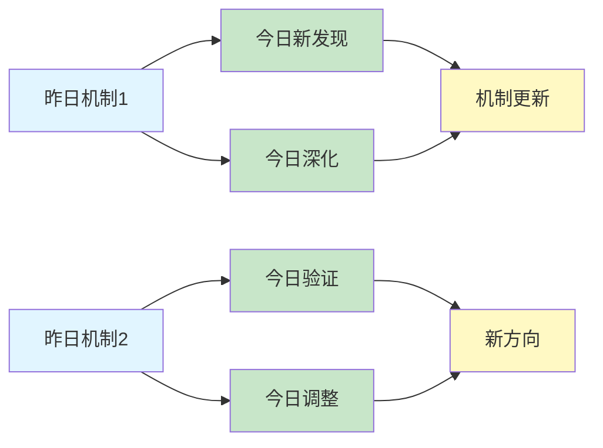
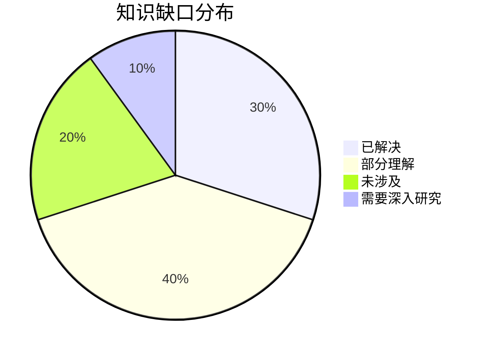
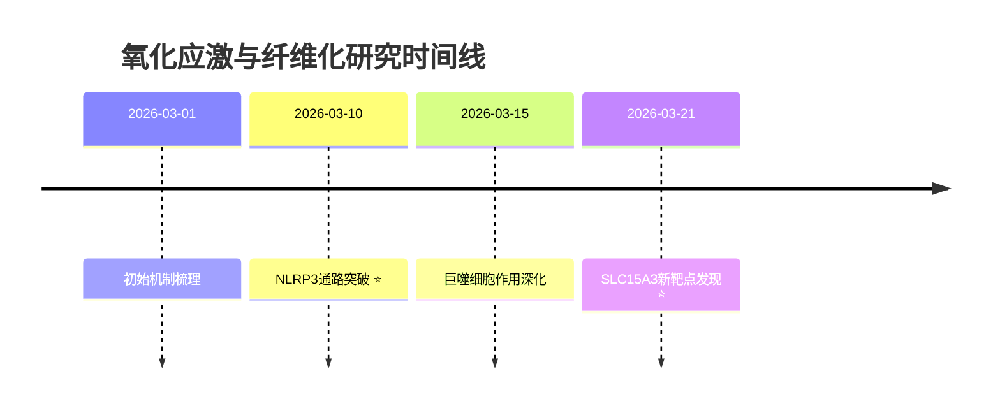

# Oxidative Stress & Fibrosis Research Skill - 完整流程

这个技能用于系统化地研究**氧化应激（Oxidative Stress）直接或通过巨噬细胞、中性粒细胞等免疫细胞促进纤维化（Fibrosis）**的最新研究进展。

**核心特点**:
- ✅ 每天精读5篇论文（质量 > 数量）
- ✅ 使用NotebookLM询问3个核心问题（每个超时1分钟）
- ✅ 生成详细的论文分析文档（至少500行）
- ✅ 每日思考文档（延续性研究）

## 📋 完整流程（必须按顺序执行）

### Step 1: 搜索PubMed最新论文 ✅

**搜索关键词组合**:
```bash
# 核心关键词
oxidative stress fibrosis
ROS macrophage fibrosis
neutrophil extracellular trap fibrosis
NLRP3 inflammasome fibrosis
mitochondrial dysfunction fibrosis

# 扩展关键词
oxidative stress myofibroblast
NADPH oxidase fibrosis
antioxidant therapy fibrosis
redox signaling fibrosis
oxidative stress epithelial mesenchymal transition
```

**执行命令**:
```bash
# 使用 PubMed E-utilities API 搜索
curl -s "https://eutils.ncbi.nlm.nih.gov/entrez/eutils/esearch.fcgi?db=pubmed&term=oxidative+stress+fibrosis+macrophage&retmode=json&retmax=20&sort=relevance"

# 获取论文详情
curl -s "https://eutils.ncbi.nlm.nih.gov/entrez/eutils/esummary.fcgi?db=pubmed&id=PMID1,PMID2,PMID3&retmode=json"
```

**输出**: JSON格式的论文列表，包含标题、摘要、链接、作者、发表日期等

---

### Step 2: 筛选最有价值的5篇论文 ✅

**筛选标准**:
1. **相关性**: 与氧化应激直接促进纤维化机制相关（直接或通过免疫细胞）
2. **创新性**: 提出新的分子机制或治疗靶点
3. **影响力**: 高影响力期刊（Nature, Science, Cell, JCI, Hepatology, Thorax等）
4. **时效性**: 最近1-6个月发表（优先）

**筛选流程**:
```bash
# 1. 查看搜索结果
cat /tmp/today_papers.json

# 2. 按相关性排序
# 3. 选择top 5（精读，不是泛读）
# 4. 记录到papers_list.md
```

**输出**: 5篇精选论文（深度分析），记录到:
- `~/.openclaw/workspace/oxidative-stress-fibrosis/papers_list.md`

---

### Step 3: 使用Subagent精读每篇论文 ✅

**⚠️ 【质量第一原则】**

```
╔════════════════════════════════════════════════════════════╗
║  🎯 核心原则：质量 > 速度                                  ║
║                                                              ║
║  ✅ 每篇论文15-20分钟是正常的                              ║
║  ✅ 深度分析比快速完成更重要                                ║
║  ✅ 使用Subagent避免token限制                              ║
║  ✅ 每篇论文独立处理，互不干扰                             ║
║                                                              ║
║  ❌ 不要为了省时而创建精简版文档                           ║
║  ❌ 不要因为token不足而降低质量                            ║
║  ❌ 不要跳过NotebookLM问答环节                             ║
╚════════════════════════════════════════════════════════════╝
```

**⚠️ 【强制要求】必须使用Subagent**

```
╔════════════════════════════════════════════════════════════╗
║  🔑 关键：每篇论文必须使用独立的Subagent                   ║
║                                                              ║
║  ✅ 原因1: 避免主session的token限制                        ║
║  ✅ 原因2: 每篇论文有独立上下文                            ║
║  ✅ 原因3: 可以并行处理（如果需要）                        ║
║  ✅ 原因4: 确保每篇论文都有完整的分析                      ║
║                                                              ║
║  ❌ 不要在主session中处理论文（会token不足）               ║
║  ❌ 不要创建精简版文档（质量不够）                         ║
╚════════════════════════════════════════════════════════════╝
```

**执行方法：使用sessions_spawn启动Subagent**

对于Step 2筛选出的5篇论文，每篇都启动一个独立的Subagent进行精读：

```bash
# 论文列表（从Step 2获得）
PAPERS=(
  "Paper-Title-1|https://pubmed.ncbi.nlm.nih.gov/12345678/|PMID:12345678"
  "Paper-Title-2|https://pubmed.ncbi.nlm.nih.gov/23456789/|PMID:23456789"
  # ... 其他论文
)

# 对每篇论文启动Subagent
for PAPER_INFO in "${PAPERS[@]}"; do
  IFS='|' read -r TITLE PUBMED_URL PMID <<< "$PAPER_INFO"
  
  # 生成paper_id（用于文件命名）
  PAPER_ID=$(echo "$TITLE" | sed 's/[^a-zA-Z0-9]/_/g')
  
  echo "📚 处理论文: $TITLE"
  
  # 启动Subagent
  sessions_spawn \
    --mode run \
    --runtime subagent \
    --task "精读论文: $TITLE
    
论文信息:
- 标题: $TITLE
- PubMed: $PUBMED_URL
- PMID: $PMID

研究领域: 氧化应激促进纤维化机制（直接或通过巨噬细胞、中性粒细胞等免疫细胞）

要求:
1. 创建NotebookLM笔记本并记录ID
2. 添加PubMed页面和PDF（如有）作为来源
3. 询问3个核心问题
4. 创建详细markdown文档（至少500行）
5. 保存到 ~/.openclaw/workspace/oxidative-stress-fibrosis/papers/

输出:
- 返回笔记本ID
- 返回文档路径
- 返回文档行数" \
    --timeout 1200 \
    --run-timeout 1200
done

echo "✅ 所有论文精读完成"
```

**Subagent执行流程**：

1. **创建NotebookLM笔记本** - 记录笔记本ID
2. **添加来源** - PubMed页面 + PDF（90秒超时）
3. **等待处理** - 30秒
4. **询问3个问题** - 每个问题90秒超时
   - Q1: 核心分子机制（氧化应激如何触发纤维化）
   - Q2: 与特定细胞类型的关系（巨噬细胞/中性粒细胞/成纤维细胞等）
   - Q3: 创新点和局限性/治疗意义
5. **创建文档** - 至少500行，包含完整问答
6. **保存文档** - 返回文档路径和行数

---

### Step 3.5: 收集Subagent结果 ✅

```bash
# 检查生成的文档
ls -lh ~/.openclaw/workspace/oxidative-stress-fibrosis/papers/ | grep "$(date +%Y-%m-%d)"

# 统计文档行数
for FILE in ~/.openclaw/workspace/oxidative-stress-fibrosis/papers/$(date +%Y-%m-%d)_*.md; do
  LINES=$(wc -l < "$FILE")
  echo "📄 $(basename $FILE): $LINES 行"
  
  if [ $LINES -lt 500 ]; then
    echo "⚠️ 警告: 文档行数不足500行"
  fi
done
```

---

### Step 4: 更新论文列表 ✅

**更新文件**: `~/.openclaw/workspace/oxidative-stress-fibrosis/papers_list.md`

---

### Step 5: 创建详细的Markdown文档 ✅

**必须为每篇论文创建详细文档！**

**文档模板**:

```markdown
# [论文标题]

**发表日期**: YYYY-MM-DD  
**PMID**: xxxxxx  
**PubMed链接**: https://pubmed.ncbi.nlm.nih.gov/xxxxx/  
**期刊**: [期刊名]  
**NotebookLM笔记本ID**: [创建后记录]

## 核心问题
[基于NotebookLM回答整理 - 这篇文章要解决什么问题]

## 主要发现
[基于NotebookLM回答整理]

### 氧化应激机制
[详细描述ROS如何产生、如何导致纤维化]

### 细胞类型作用
[详细描述涉及的细胞类型：巨噬细胞/中性粒细胞/成纤维细胞等]

### 分子通路
[详细描述涉及的信号通路：NLRP3/Nrf2/NF-κB等]

## 关键创新
1. **创新点1**: [描述]
2. **创新点2**: [描述]
3. **创新点3**: [描述]

## 实验证据
### 实验设置
[描述]

### 关键数据
[数据]

### 对比分析
[对比]

## 与纤维化的关系
### 直接机制
[氧化应激如何直接促进纤维化]

### 间接机制（免疫细胞）
[通过巨噬细胞/中性粒细胞等如何促进纤维化]

### 治疗意义
[潜在的治疗靶点和干预策略]

## NotebookLM问答记录

### Q1: 核心分子机制
**问题**: 这篇文章揭示的氧化应激促进纤维化的核心分子机制是什么？

**回答**: [NotebookLM的完整回答]

### Q2: 与特定细胞类型的关系
**问题**: 这篇文章中巨噬细胞/中性粒细胞/成纤维细胞等如何参与氧化应激诱导的纤维化？

**回答**: [NotebookLM的完整回答]

### Q3: 创新点和局限性
**问题**: 这项研究的主要创新点是什么？有什么局限性或未来方向？

**回答**: [NotebookLM的完整回答]

## 个人思考
[深度思考和分析]

1. **最有趣的发现**: [什么]
2. **最意外的机制**: [什么]
3. **治疗潜力**: [对临床治疗的启示]
4. **与昨日研究的关联**: [如何与之前的研究关联]

## 参考文献
[相关的重要文献]

## 标签
`#oxidative-stress` `#fibrosis` `#macrophage` `#ROS` `#[其他相关标签]`
```

**质量要求**:
- ✅ 至少500行
- ✅ 包含完整的NotebookLM问答记录（不总结）
- ✅ 包含分子机制详细分析
- ✅ 包含细胞类型作用分析
- ✅ 包含个人思考和见解
- ✅ 记录NotebookLM笔记本ID

---

### Step 6: 生成每日思考文档 ✅

**⚠️ 这是最重要的输出，必须详细！**

**文件名**: `~/.openclaw/workspace/oxidative-stress-fibrosis/daily_thinking/YYYY-MM-DD.md`

**必须包含的内容**:

```markdown
# 氧化应激与纤维化研究 - YYYY-MM-DD

## 📋 每日总结

**⚠️ 这一部分是必须的，放在文档最前面，快速概览当天研究！**

### 🎯 今日核心

**研究主题**: [今天的主要研究方向，如：氧化应激-巨噬细胞-肺纤维化轴]

**论文数量**: 5篇精选论文（从X篇中筛选）

**关键突破**: 
- 🚀 [最重要的发现1，如：SLC15A3调控巨噬细胞氧化应激]
- 🚀 [最重要的发现2，如：Nrf2通路的核心保护作用]
- 🚀 [最重要的发现3，如：Piezo1机械敏感性与代谢的交叉]

**机制演进**: [如：ROS → NLRP3 → IL-1β → myofibroblast活化]

**问题解决**: [如：解决了X个问题，新识别Y个问题]

### 📊 一句话总结

[用1-2句话概括今天最重要的进展]

**示例**:
> "今天揭示了氧化应激通过SLC15A3调控巨噬细胞极化进而促进肺纤维化的新机制，Nrf2通路作为核心抗氧化靶点得到进一步验证。"

### 🔗 延续性

**昨日→今日**: [简述从昨天的哪个方向延续而来]

**今日→明日**: [简述明天可能的研究方向]

**示例**:
- 昨日→今日: "氧化应激基础机制 → 巨噬细胞介导的纤维化（SLC15A3）"
- 今日→明日: "巨噬细胞 → 中性粒细胞/NETs与纤维化的关系"

### 📈 关键数据

- **论文分析**: 5篇（X篇中筛选）
- **核心见解**: X个新见解
- **机制更新**: 新发现X条信号通路
- **问题追踪**: 解决X/Y个（XX%）
- **知识缺口**: 已解决XX%，部分理解XX%，未涉及XX%

### 🎓 今日收获

**Top 3 发现**:
1. **[发现1标题]** - [1句话说明为什么重要]
2. **[发现2标题]** - [1句话说明为什么重要]
3. **[发现3标题]** - [1句话说明为什么重要]

**最大惊喜**: [今天最意外的发现或转折]

**待解决**: [最需要明天深入的问题]

### 💡 本质思考：氧化应激如何促进纤维化

**⚠️ 这是每日总结的核心部分，必须深刻思考！**

**要求**: 结合今日获得的所有信息，从以下3个维度进行本质层面的思考：

#### 1. 核心机制的本质是什么？

**思考方向**:
- 氧化应激促进纤维化的**最根本机制**是什么？
- 今日论文揭示了哪些**不可或缺的分子环节**？
- 这些机制之间有什么**内在联系**？

**示例**:
```
今日发现SLC15A3调控巨噬细胞氧化应激是肺纤维化的关键，但本质是：
1. ROS累积 → 巨噬细胞M1极化 → 促炎因子释放 → 成纤维细胞活化
2. 线粒体功能障碍 → ROS泄漏 → NLRP3激活 → IL-1β → 纤维化
3. Nrf2通路失活 → 抗氧化能力下降 → 氧化损伤累积 → EMT

本质：氧化应激是纤维化的"启动信号"，通过免疫细胞-成纤维细胞轴驱动纤维化进程
```

#### 2. 当前方法与理想目标的差距在哪里？

**思考方向**:
- 理想的抗纤维化治疗应该靶向哪个环节？
- 当前最先进方法（包括今日论文）还缺什么？
- **最大的瓶颈**是什么？（靶点特异性、递送方式、安全性？）

**示例**:
```
差距分析：
- ✅ 已明确：ROS是核心驱动因子，Nrf2是核心保护通路
- ❌ 缺失：特异性靶向巨噬细胞ROS的药物
- ❌ 缺失：临床可用的抗氧化疗法（多数抗氧化剂临床失败）
- ⚠️ 瓶颈：如何实现组织特异性ROS清除而不影响正常生理功能

最大瓶颈：ROS在生理和病理中的双重角色使得靶向治疗困难
```

#### 3. 从今天到临床应用，最可能的路径是什么？

**思考方向**:
- 基于今日发现，**下一步应该做什么**？
- 哪条技术路线**最有可能成功**？
- 需要**突破哪些关键技术**？

**示例**:
```
技术路线预测：
1. 短期（3-6月）：验证SLC15A3作为治疗靶点（动物模型）
2. 中期（6-12月）：开发SLC15A3激动剂/抑制剂
3. 长期（1-2年）：临床前研究 + 纳米递送系统

关键突破点：
- 如何实现巨噬细胞特异性递送
- Nrf2激活剂的临床转化
- ROS清除与抗氧化治疗的平衡
```

---

## 今日论文概览

今天精读了5篇氧化应激与纤维化相关的前沿论文，涵盖肺纤维化、肝纤维化、巨噬细胞极化等主题。

### 论文列表
1. **论文1** - [简短描述和核心发现]
2. **论文2** - [简短描述和核心发现]
3. **论文3** - [简短描述和核心发现]
4. **论文4** - [简短描述和核心发现]
5. **论文5** - [简短描述和核心发现]

## 核心见解

### 1. [见解1标题]
[基于今日论文的发现]

**从[论文X]获得**:
- ✅ [具体发现]
- ✅ [具体发现]

**对纤维化机制的启发**:
[深入思考]

### 2. [见解2标题]
[基于今日论文的发现]

...

## 与昨日思考的联系

**昨日重点**: [昨天的主要思考]

**今日进展**:
- [如何延续昨天的思考]
- [新的发现]
- [更新的理解]

---

## 📊 知识演进图

**⚠️ 这一部分是必须的，可视化展示知识的延续性发展！**

### 核心机制演进



**图例说明**:
- 🔵 蓝色: 昨天的见解
- 🟢 绿色: 今天的新发现/深化
- 🟡 黄色: 机制/方向的更新

### 具体演进路径

| 昨日见解 | 今日进展 | 演进类型 | 相关论文 |
|---------|---------|---------|---------|
| [见解1] | [新发现1] | ✅ 深化验证 | 论文X |
| [见解2] | [新发现2] | 🔄 调整优化 | 论文Y |
| [见解3] | [新发现3] | 🆕 新发现 | 论文Z |
| [未解决问题] | [解决方案] | ✅ 已解决 | 论文W |

**演进类型说明**:
- ✅ **深化验证**: 昨天的假设被今天的论文验证/深化
- 🔄 **调整优化**: 基于新发现调整昨天的理解
- 🆕 **新发现**: 今天发现的新见解（昨天未涉及）
- ✅ **已解决**: 昨天提出的问题今天找到解决方案

### 氧化应激-纤维化通路更新

**昨日通路**:
```
ROS → [某环节] → 成纤维细胞活化 → 纤维化
```

**今日通路**:
```
ROS → NLRP3 → IL-1β → 成纤维细胞活化 → 纤维化 ⭐ NEW
     ↓
  巨噬细胞极化(M1/M2) → 促纤维化微环境 ⭐ NEW
     ↓
  线粒体功能障碍 → ROS泄漏 → 氧化损伤累积 ⭐ NEW
```

**演进说明**:
- ⭐ NEW: 今天新增的环节
- 🔄: 今天更新/细化的内容
- ✅: 保持不变（验证有效）

### 关键分子靶点演进

| 靶点/通路 | 昨日认知 | 今日更新 | 变化 |
|-----------|---------|---------|------|
| NLRP3 | 促炎 | 纤维化核心驱动 | 🔄 更新 |
| Nrf2 | 抗氧化 | 核心保护通路 | ✅ 验证 |
| SLC15A3 | - | 巨噬细胞新靶点 | ⭐ 新增 |
| Piezo1 | 机械敏感 | 氧化应激交叉 | ⭐ 新增 |

### 问题追踪

**昨日未解决问题**:
1. ❓ [问题1] → ✅ 今日解决（论文X）
2. ❓ [问题2] → ⏳ 部分进展（论文Y）
3. ❓ [问题3] → ❌ 仍然未解决

**今日新识别问题**:
1. ❓ [新问题1] - 来自论文Z
2. ❓ [新问题2] - 来自论文W

**优先级排序**:
- 🔥 高优先级: [问题]
- ⚡ 中优先级: [问题]
- 💡 低优先级: [问题]

### 知识缺口分析



**缺口详情**:
1. **已解决** (30%): [列出]
2. **部分理解** (40%): [列出]
3. **未涉及** (20%): [列出]
4. **需要深入研究** (10%): [列出]

### 关键里程碑



---

## 氧化应激-纤维化机制总结

### 核心信号通路

[总结今日发现的氧化应激→纤维化关键通路]

```
┌─────────────────────────────────────────────────────────────┐
│                    氧化应激-纤维化核心通路                    │
├─────────────────────────────────────────────────────────────┤
│                                                             │
│  环境因素      ROS产生         信号传导       细胞响应       │
│  (烟雾/辐射) ──→ NADPH氧化酶 ──→ NLRP3 ──→ IL-1β ──→ 成纤   │
│       ↓                               ↓              维细胞   │
│  线粒体                              ↓             活化      │
│  功能障碍  ──→ ROS泄漏           巨噬细胞                   │
│       ↓                    极化(M1/M2)                     │
│       ↓                           ↓                         │
│  氧化损伤  ─────────────────────────→ 促纤维化微环境        │
│                                                             │
└─────────────────────────────────────────────────────────────┘
```

### 免疫细胞作用

[总结巨噬细胞/中性粒细胞在纤维化中的作用]

| 细胞类型 | 作用 | 关键分子 | 治疗意义 |
|---------|------|---------|---------|
| 巨噬细胞(M1) | 促炎/促纤维化 | ROS, IL-1β, TNF-α | 抑制M1极化 |
| 巨噬细胞(M2) | 修复/纤维化 | TGF-β, IL-10 | 调控M1/M2平衡 |
| 中性粒细胞 | NETs形成 | NE, ROS | 清除NETs |
| 成纤维细胞 | ECM沉积 | α-SMA, collagen | 抑制活化 |

### 治疗靶点

[总结潜在的治疗靶点和抗氧化治疗策略]

| 靶点 | 策略 | 药物/分子 | 临床阶段 |
|------|------|----------|---------|
| NLRP3 | 抑制剂 | MCC950 | 临床前 |
| Nrf2 | 激活剂 | Sulforaphane | 临床试验 |
| ROS清除 | 抗氧化 | NAC | 临床使用 |
| TGF-β | 抗体 | Fresolimumab | 临床试验 |

---

## 下一步

1. **延续线索**: [从昨天→今天→明天]
2. **新线索**: [今天发现的新方向]
3. **待验证**: [需要进一步验证的假设]

**预期演进路径**:
```
昨日: 氧化应激基础机制
  ↓
今日: 巨噬细胞介导的纤维化 (SLC15A3)
  ↓
明日: 中性粒细胞/NETs与纤维化的关系 (?)
```

---

**关键词**: `#oxidative-stress` `#fibrosis` `#macrophage` `#ROS` `#NLRP3` `#Nrf2`
```

---

### Step 7: 自动提交到GitHub ✅

```bash
cd ~/.openclaw/workspace/oxidative-stress-fibrosis
git add .
git commit -m "feat: Oxidative Stress & Fibrosis Research - $(date '+%Y-%m-%d')

- 分析5篇论文（PubMed最新）
- 生成论文深度分析文档
- 更新每日思考文档
- 更新论文列表

Oxidative Stress & Fibrosis Research v1.1"
git push origin master
```

---

## 📁 完整文件结构

```
~/.openclaw/workspace/oxidative-stress-fibrosis/
├── papers/                    # 论文深度分析
│   └── YYYY-MM-DD_XX_*.md    # 每篇论文的详细分析（500+行）
├── daily_thinking/           # 每日研究思考
│   └── YYYY-MM-DD.md         # 每日详细思考（1000+行）
├── papers_list.md             # 论文汇总列表
├── SKILL.md                  # 研究流程Skill
└── README.md                 # 项目说明
```

---

## ⏱️ 时间估算

| 步骤 | 时间 | 备注 |
|------|------|------|
| 1. 搜索论文 | 10分钟 | PubMed API |
| 2. 筛选论文 | 10分钟 | 人工筛选5篇 |
| 3. Subagent精读（5篇） | 90分钟 | 串行18分钟/篇 |
| 3.5. 收集结果 | 5分钟 | 检查文档质量 |
| 4. 更新列表 | 5分钟 | papers_list.md |
| 5. 生成思考 | 30分钟 | 深度思考 |
| 6. Git提交推送 | 2分钟 | 自动提交 |
| **总计** | **~2.5小时** | |

---

## ✅ 质量检查清单

### 执行前
- [ ] PubMed API 可用
- [ ] NotebookLM CLI可用
- [ ] 目录已创建

### 执行中（整体流程）
- [ ] Step 1: 搜索5个关键词组合
- [ ] Step 2: 筛选出5篇最有价值的论文
- [ ] Step 3: 对每篇论文启动Subagent
- [ ] Step 3.5: 收集Subagent结果并验证质量
- [ ] Step 4: 更新papers_list.md
- [ ] Step 5: 生成每日思考文档（参考前日）
- [ ] Step 6: Git提交推送

### 执行中（每篇论文Subagent）
- [ ] Subagent启动成功
- [ ] NotebookLM笔记本创建成功
- [ ] 添加PubMed页面作为来源
- [ ] 询问Q1：核心分子机制
- [ ] 询问Q2：与特定细胞类型的关系
- [ ] 询问Q3：创新点和局限性
- [ ] 创建详细文档（至少500行）
- [ ] 文档包含NotebookLM笔记本ID

### 执行后（每篇论文）
- [ ] 文档至少500行
- [ ] 包含完整的NotebookLM问答记录
- [ ] 包含分子机制详细分析
- [ ] 包含细胞类型作用分析
- [ ] 保存到正确位置

### 每日完成
- [ ] 所有5篇论文完成
- [ ] papers_list.md已更新
- [ ] 每日思考文档已创建（1000+行）
- [ ] 参考了前一天的思考
- [ ] Git已提交并推送

---

## 🎯 核心原则

1. **必须使用Subagent进行论文精读**
2. **必须询问3个核心问题** - Q1分子机制 + Q2细胞类型关系 + Q3创新点/局限
3. **必须创建详细文档** - 至少500行，完整问答
4. **每日思考必须详细** - 至少1000行，包含知识演进图
5. **必须参考昨日思考** - 延续性研究
6. **质量 > 数量** - 精读5篇 > 泛读10篇

---

**版本**: v1.1
**主题**: 氧化应激直接或通过免疫细胞促进纤维化的机制研究
**维护者**: OpenClaw AI

**最后更新**: 2026-03-21
