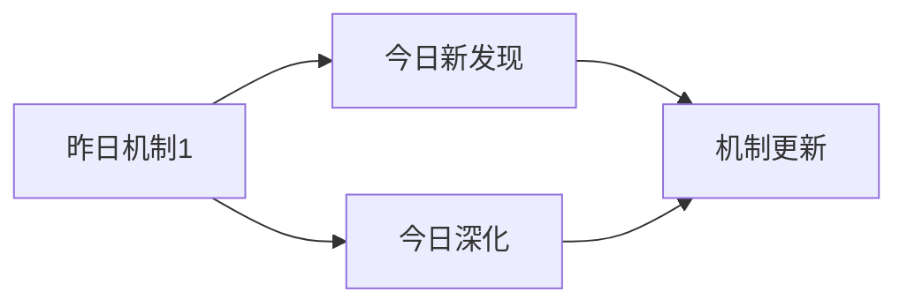

# Oxidative Stress & Fibrosis Research Skill - 完整流程

这个技能用于系统化地研究**氧化应激（Oxidative Stress）直接或通过巨噬细胞、中性粒细胞等免疫细胞促进纤维化（Fibrosis）**的最新研究进展。

**核心特点**:
- ✅ 每天精读5篇论文（质量 > 数量）
- ✅ 使用NotebookLM询问3个核心问题（每个超时1分钟）
- ✅ 生成详细的论文分析文档（至少500行）
- ✅ 每日思考文档（延续性研究）

## 📋 完整流程（必须按顺序执行）

### Step 1: 搜索PubMed最新论文 ✅

**搜索关键词组合**:
- `oxidative stress fibrosis`
- `ROS macrophage fibrosis`
- `neutrophil extracellular trap fibrosis`
- `NLRP3 inflammasome fibrosis`
- `mitochondrial dysfunction fibrosis`
- `oxidative stress myofibroblast`
- `NADPH oxidase fibrosis`
- `antioxidant therapy fibrosis`
- `redox signaling fibrosis`
- `oxidative stress epithelial mesenchymal transition`

**执行命令**:
```bash
cd ~/.openclaw/workspace/scripts

# 搜索多个关键词组合
python3 search_pubmed.py "oxidative stress fibrosis" 20
python3 search_pubmed.py "ROS macrophage fibrosis" 20
python3 search_pubmed.py "neutrophil extracellular trap fibrosis" 20
python3 search_pubmed.py "NLRP3 inflammasome fibrosis" 20
python3 search_pubmed.py "mitochondrial dysfunction fibrosis" 20
```

**输出**: JSON格式的论文列表，包含标题、摘要、链接、作者、发表日期等

---

### Step 2: 筛选最有价值的5篇论文 ✅

**筛选标准**:
1. **相关性**: 与氧化应激直接促进纤维化机制相关
2. **创新性**: 提出新的分子机制或治疗靶点
3. **影响力**: 高影响力期刊（Nature, Science, Cell, JCI, Hepatology等）
4. **时效性**: 最近1-6个月发表（优先）

**筛选流程**:
```bash
# 1. 查看搜索结果
cat /tmp/today_papers.json

# 2. 按相关性排序
# 3. 选择top 5（精读，不是泛读）
# 4. 记录到papers_list.md
```

**输出**: 5篇精选论文（深度分析），记录到:
- `~/.openclaw/workspace/oxidative-stress-fibrosis/papers_list.md`

---

### Step 3: 使用Subagent精读每篇论文 ✅

**⚠️ 【质量第一原则】**

```
╔════════════════════════════════════════════════════════════╗
║  🎯 核心原则：质量 > 速度                                  ║
║                                                              ║
║  ✅ 每篇论文15-20分钟是正常的                              ║
║  ✅ 深度分析比快速完成更重要                                ║
║  ✅ 使用Subagent避免token限制                              ║
║  ✅ 每篇论文独立处理，互不干扰                             ║
║                                                              ║
║  ❌ 不要为了省时而创建精简版文档                           ║
║  ❌ 不要因为token不足而降低质量                            ║
║  ❌ 不要跳过NotebookLM问答环节                             ║
╚════════════════════════════════════════════════════════════╝
```

**⚠️ 【强制要求】必须使用Subagent**

```
╔════════════════════════════════════════════════════════════╗
║  🔑 关键：每篇论文必须使用独立的Subagent                   ║
║                                                              ║
║  ✅ 原因1: 避免主session的token限制                        ║
║  ✅ 原因2: 每篇论文有独立上下文                            ║
║  ✅ 原因3: 可以并行处理（如果需要）                        ║
║  ✅ 原因4: 确保每篇论文都有完整的分析                      ║
║                                                              ║
║  ❌ 不要在主session中处理论文（会token不足）               ║
║  ❌ 不要创建精简版文档（质量不够）                         ║
╚════════════════════════════════════════════════════════════╝
```

**执行方法：使用sessions_spawn启动Subagent**

对于Step 2筛选出的5篇论文，每篇都启动一个独立的Subagent进行精读：

```bash
# 论文列表（从Step 2获得）
PAPERS=(
  "Paper-Title-1|https://pubmed.ncbi.nlm.nih.gov/12345678/|https://pubmed.ncbi.nlm.nih.gov/12345678/|PMID:12345678"
  "Paper-Title-2|https://pubmed.ncbi.nlm.nih.gov/23456789/|https://pubmed.ncbi.nlm.nih.gov/23456789/|PMID:23456789"
  # ... 其他论文
)

# 对每篇论文启动Subagent
for PAPER_INFO in "${PAPERS[@]}"; do
  IFS='|' read -r TITLE PUBMED_URL ABSTRACT_URL PMID <<< "$PAPER_INFO"
  
  # 生成paper_id（用于文件命名）
  PAPER_ID=$(echo "$TITLE" | sed 's/[^a-zA-Z0-9]/_/g')
  
  echo "📚 处理论文: $TITLE"
  
  # 启动Subagent
  sessions_spawn \
    --mode run \
    --runtime subagent \
    --task "使用paper-analysis skill精读论文: $TITLE
    
论文信息:
- 标题: $TITLE
- PubMed: $PUBMED_URL
- PMID: $PMID
- Paper ID: $PAPER_ID

研究领域: 氧化应激促进纤维化机制（直接或通过巨噬细胞、中性粒细胞等免疫细胞）

要求:
1. 创建NotebookLM笔记本并记录ID
2. 添加PubMed页面和PDF（如有）作为来源
3. 询问3个核心问题（核心机制、与纤维化的关系、创新点/局限）
4. 创建详细markdown文档（至少500行）
5. 保存到 ~/.openclaw/workspace/oxidative-stress-fibrosis/papers/

输出格式:
- 返回笔记本ID
- 返回文档路径
- 返回文档行数" \
    --timeout 1200 \
    --run-timeout 1200
done

echo "✅ 所有论文精读完成"
```

**Subagent执行流程**（paper-analysis skill）：

1. **创建NotebookLM笔记本** - 记录笔记本ID
2. **添加来源** - PubMed页面 + PDF（90秒超时）
3. **等待处理** - 30秒
4. **询问3个问题** - 每个问题90秒超时
   - Q1: 核心分子机制（氧化应激如何触发纤维化）
   - Q2: 与特定细胞类型的关系（巨噬细胞/中性粒细胞/成纤维细胞等）
   - Q3: 创新点和局限性/治疗意义
5. **创建文档** - 至少500行，包含完整问答
6. **保存文档** - 返回文档路径和行数

---

### Step 3.5: 收集Subagent结果 ✅

所有Subagent完成后，收集结果：

```bash
# 检查生成的文档
ls -lh ~/.openclaw/workspace/oxidative-stress-fibrosis/papers/ | grep "$(date +%Y-%m-%d)"

# 统计文档行数
for FILE in ~/.openclaw/workspace/oxidative-stress-fibrosis/papers/$(date +%Y-%m-%d)_*.md; do
  LINES=$(wc -l < "$FILE")
  echo "📄 $(basename $FILE): $LINES 行"
  
  # 检查是否满足500行要求
  if [ $LINES -lt 500 ]; then
    echo "⚠️ 警告: 文档行数不足500行"
  fi
done
```

---

### Step 4: 更新论文列表 ✅

**更新文件**: `~/.openclaw/workspace/oxidative-stress-fibrosis/papers_list.md`

**添加内容**:
```markdown
## YYYY-MM-DD 研究的论文（精选5篇）

1. **论文1标题** - PMID: xxxxxx
   - 相关性: ⭐⭐⭐⭐⭐
   - 关键词: xxx, yyy, zzz
   - 文档: papers/YYYY-MM-DD_01_xxx.md
   - NotebookLM: [notebook_id]

2. **论文2标题** - PMID: yyyyyy
   - 相关性: ⭐⭐⭐⭐⭐
   - 关键词: xxx, yyy, zzz
   - 文档: papers/YYYY-MM-DD_02_yyy.md
   - NotebookLM: [notebook_id]

...（共5篇）
```

---

### Step 5: 生成每日思考文档 ✅

**文件名**: `~/.openclaw/workspace/oxidative-stress-fibrosis/daily_thinking/YYYY-MM-DD.md`

**必须包含的内容**:

```markdown
# 氧化应激与纤维化研究 - YYYY-MM-DD

## 📋 每日总结

### 🎯 今日核心
**研究主题**: 氧化应激促进纤维化的分子机制

**论文数量**: 5篇精选论文（从X篇中筛选）

**关键突破**: 
- 🚀 [最重要的发现1]
- 🚀 [最重要的发现2]
- 🚀 [最重要的发现3]

**机制演进**: [如：ROS → NLRP3 → IL-1β → myofibroblast]

**问题解决**: [如：解决了X个问题，新识别Y个问题]

### 📊 一句话总结

[用1-2句话概括今天最重要的进展]

### 🔗 延续性
- 昨日→今日: [简述]
- 今日→明日: [简述]

### 📈 关键数据
- 论文分析: 5篇
- 核心见解: X个新见解
- 问题追踪: 解决X/Y个（XX%）

### 🎓 今日收获
**Top 3 发现**:
1. **[发现1标题]** - [1句话]
2. **[发现2标题]** - [1句话]
3. **[发现3标题]** - [1句话]

### 💡 本质思考：氧化应激如何促进纤维化

#### 1. 核心机制的本质是什么？
[思考氧化应激触发纤维化的最根本机制]

#### 2. 当前方法与理想目标的差距在哪里？
[分析现有研究的不足和治疗潜力]

#### 3. 从今天到应用，最可能的路径是什么？
[预测治疗靶点和研究方向]

---

## 今日论文概览

今天精读了5篇氧化应激与纤维化相关的前沿论文。

### 论文列表
1. **论文1** - [简短描述和核心发现]
2. **论文2** - [简短描述和核心发现]
3. **论文3** - [简短描述和核心发现]
4. **论文4** - [简短描述和核心发现]
5. **论文5** - [简短描述和核心发现]

## 核心见解

### 1. [见解1标题]
[基于今日论文的发现]

### 2. [见解2标题]
...

## 与昨日思考的联系

**昨日重点**: [昨天的主要思考]

**今日进展**: [如何延续]

## 📊 知识演进图

### 核心机制演进



### 问题追踪

| 昨日问题 | 今日进展 | 状态 |
|---------|---------|------|
| [问题1] | [解决/部分/未解决] | ✅/⏳/❌ |
| [问题2] | ... | ... |

---

## 关键发现总结

### 氧化应激核心通路

[总结今日发现的氧化应激→纤维化关键通路]

### 免疫细胞作用

[总结巨噬细胞/中性粒细胞在纤维化中的作用]

### 治疗靶点

[总结潜在的治疗靶点和抗氧化治疗策略]

---

## 下一步

1. [明天的计划]
2. [需要深入研究的点]
3. [待验证的假设]

---

**关键词**: `#oxidative-stress` `#fibrosis` `#macrophage` `#neutrophil` `#ROS`
```

---

## 📁 完整文件结构

```
~/.openclaw/workspace/oxidative-stress-fibrosis/
├── papers/                    # 论文介绍文档
│   ├── YYYY-MM-DD_01_paper1.md
│   ├── YYYY-MM-DD_02_paper2.md
│   └── ...
├── daily_thinking/            # 每日思考
│   ├── YYYY-MM-DD.md
│   └── ...
├── papers_list.md             # 论文列表
└── README.md                  # 项目说明
```

---

## ⏱️ 时间估算

| 步骤 | 时间 | 备注 |
|------|------|------|
| 1. 搜索论文 | 10分钟 | 自动执行 |
| 2. 筛选论文 | 10分钟 | 人工筛选5篇 |
| 3. Subagent精读（5篇） | 90分钟 | 串行18分钟/篇 |
| 3.5. 收集结果 | 5分钟 | 检查文档质量 |
| 4. 更新列表 | 5分钟 | papers_list.md |
| 5. 生成思考 | 30分钟 | 深度思考 |
| 6. Git提交推送 | 2分钟 | 自动提交到GitHub |
| **总计** | **~2.5小时** | |

---

## ✅ 质量检查清单

### 执行前
- [ ] PubMed搜索脚本可用
- [ ] NotebookLM CLI可用
- [ ] 目录已创建

### 执行中（整体流程）
- [ ] Step 1: 搜索5个关键词组合
- [ ] Step 2: 筛选出5篇最有价值的论文
- [ ] Step 3: 对每篇论文启动Subagent
- [ ] Step 3.5: 收集Subagent结果并验证质量
- [ ] Step 4: 更新papers_list.md
- [ ] Step 5: 生成每日思考文档（参考前日）

### 执行后（每篇论文）
- [ ] 文档至少500行
- [ ] 包含完整的NotebookLM问答记录
- [ ] 添加个人思考和见解
- [ ] 保存到正确位置

### 每日完成
- [ ] 所有5篇论文完成
- [ ] papers_list.md已更新
- [ ] 每日思考文档已创建
- [ ] 参考了前一天的思考
- [ ] Git已提交并推送到远程仓库

---

### Step 6: 自动提交到GitHub ✅

**⚠️ 这一步是必须的，确保每日研究成果及时同步！**

**执行操作**:
```bash
# 方法1: 执行预生成的提交脚本（推荐）
bash /tmp/oxidative_stress_fibrosis_commit_after_research.sh

# 方法2: 手动提交（如果脚本失败）
cd ~/.openclaw/workspace/oxidative-stress-fibrosis
git add .
git commit -m "feat: Oxidative Stress & Fibrosis Research - $(date '+%Y-%m-%d')

- 分析5篇论文（PubMed最新）
- 生成论文深度分析文档
- 更新每日思考文档
- 更新论文列表

Oxidative Stress & Fibrosis Research v1.0"
git push origin master
```

**提交内容**:
- ✅ 论文分析文档（papers/）
- ✅ 每日思考（daily_thinking/）
- ✅ 论文列表（papers_list.md）
- ✅ README更新（如有）

**提交时间**: 立即（在Step 5完成后）

**提交信息格式**:
```
feat: Oxidative Stress & Fibrosis Research - YYYY-MM-DD

- 分析5篇论文（PubMed最新）
- 生成论文深度分析文档
- 更新每日思考文档
- 更新论文列表

Oxidative Stress & Fibrosis Research v1.0
```

**验证提交**:
```bash
# 查看最新提交
git log --oneline -1

# 查看远程仓库
# 访问: https://github.com/ihbhunobuyb/oxi
```

**预计时间**: 1-2分钟

---

## 🎯 核心原则

1. **必须使用Subagent进行论文精读**
2. **必须询问3个核心问题** - Q1机制原理 + Q2细胞类型关系 + Q3创新点/局限
3. **必须创建详细文档** - 至少500行，完整问答
4. **必须参考昨日思考** - 延续性研究
5. **质量 > 数量** - 精读5篇 > 泛读10篇

---

**版本**: v1.0
**主题**: 氧化应激直接或通过免疫细胞促进纤维化的机制研究
**维护者**: OpenClaw AI

**最后更新**: 2026-03-21
