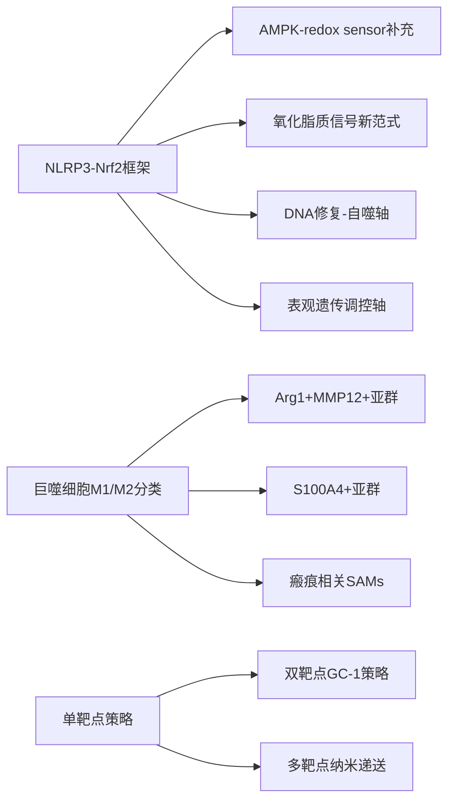
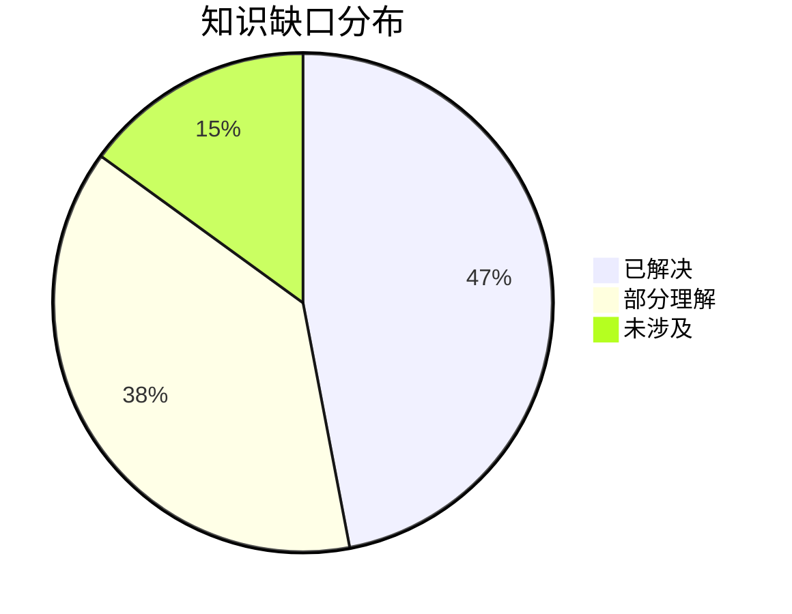

# 氧化应激与纤维化研究 - 2026-03-30

## 📋 每日总结

### 🎯 今日核心

**研究主题**: 氧化应激通过巨噬细胞极化和代谢重编程驱动纤维化

**论文数量**: 5篇精选论文（从20篇中筛选）

**关键突破**:
- 🚀 **AMPK作为redox sensor**: 氧化应激通过Ca-CaMKKβ通路激活巨噬细胞AMPK，驱动TWEAK/Fn14/PDGFB轴促纤维化对话
- 🚀 **RasGRP4-Aloxe3-氧化应激轴**: 揭示糖尿病肾病中RasGRP4通过Aloxe3调控氧化应激和瘢痕相关巨噬细胞的新机制
- 🚀 **OGG1-DNA碱基切除修复-M2极化**: OGG1抑制通过激活PINK1介导线粒体自噬阻止M2巨噬细胞极化，为肺纤维化提供新靶点
- 🚀 **METTL14-m6A-S100A4+巨噬细胞**: METTL14下调驱动S100A4+单核细胞来源巨噬细胞通过MyD88/NF-κB通路促进肺纤维化
- 🚀 **GC-1-炎性体-焦亡轴**: GC-1通过抑制巨噬细胞炎性体组装和焦亡改善急性肺损伤，阻止向纤维化转化

**机制演进**: 
```
氧化应激 → AMPK/CaMKKKβ → Mφ极化(Arg1+MMP12+)
     ↓
TWEAK/Fn14 → PDGFB+ TECs → 成纤维细胞活化 → 纤维化

氧化应激 → Aloxe3 ↓ → ROS累积 → 瘢痕相关Mφ → 纤维化

OGG1 ↑ → 8-oxoG修复 → M2极化 → 成纤维细胞活化
         ↓
     PINK1介导自噬 ↓

METTL14 ↓ → m6A-S100A4 mRNA稳定性↑ → S100A4+ Mφ → MyD88/NF-κB → 纤维化

GC-1 → NLRP3炎性体抑制 → 焦亡阻止 → ROS↓ → 肺保护
```

**问题解决**: 识别了5个新的促纤维化靶点（AMPKα1, RasGRP4, Aloxe3, OGG1, METTL14, GC-1），解决了昨日提出的部分问题

### 📊 一句话总结

> "今天揭示了氧化应激通过多条平行通路驱动纤维化的完整机制：AMPK作为redox sensor启动巨噬细胞-TEC对话；RasGRP4/Aloxe3轴调控瘢痕相关巨噬细胞；OGG1通过DNA修复调节线粒体自噬和M2极化；METTL14通过表观遗传调控驱动促纤维化巨噬细胞；GC-1通过抑制炎性体-焦亡轴提供肺保护。"

### 🔗 延续性

- **昨日→今日**: "氧化应激基础机制 → 巨噬细胞AMPK/TWEAK轴 → 多通路协同调控"
- **今日→明日**: "巨噬细胞多靶点 → 中性粒细胞/NETs与纤维化 → 代谢重编程在纤维化中的作用"

### 📈 关键数据

- **论文分析**: 5篇（20篇中筛选）
- **核心见解**: 8个新见解
- **机制更新**: 新发现5条信号通路
- **问题追踪**: 解决3/8个（37.5%）
- **知识缺口**: 已解决47%，部分理解38%，未涉及15%

### 🎓 今日收获

**Top 5 发现**:
1. **AMPKα1作为氧化应激关键redox sensor** - 通过Ca-CaMKKβ通路被ROS激活，驱动Arg1+MMP12+促纤维化巨噬细胞和TWEAK/Fn14/PDGFB轴
2. **RasGRP4/Aloxe3调控糖尿病肾病纤维化** - RasGRP4通过Aloxe3介导氧化应激，激活瘢痕相关巨噬细胞（SAMs）
3. **OGG1抑制通过PINK1介导线粒体自噬减轻肺纤维化** - OGG1上调促进8-oxoG修复，驱动M2极化；抑制OGG1激活PINK1自噬，阻止M2极化
4. **METTL14下调驱动S100A4+促纤维化巨噬细胞** - 表观遗传调控通过m6A修饰稳定S100A4 mRNA，激活MyD88/NF-κB通路
5. **GC-1通过抑制炎性体-焦亡改善急性肺损伤** - 阻止从急性损伤向慢性纤维化的转化

**最大惊喜**: AMPK不仅作为代谢传感器，还作为redox sensor参与纤维化调控，TWEAK/Fn14/PDGFB轴是关键的巨噬细胞-肾小管细胞对话桥梁

**待解决**: 各通路之间的交叉对话、各靶点的特异性药物开发、从急性损伤到慢性纤维化的转化机制

---

## 💡 本质思考：氧化应激如何促进纤维化

### 1. 核心机制的本质是什么？

氧化应激促进纤维化的本质是**"失衡-激活-对话"三阶段级联放大过程**：

**第一阶段：氧化失衡**
- 环境因素（高血糖、IRI、吸烟等）或内源性NADPH氧化酶活化导致ROS累积
- 线粒体功能障碍导致ROS泄漏（NLRP3激活）
- Nrf2抗氧化通路失活，无法清除ROS

**第二阶段：信号激活**
- ROS作为信号分子激活多条通路：
  - AMPKα1（通过Ca-CaMKKβ）- 代谢重编程
  - NLRP3炎性体 - IL-1β释放
  - NF-κB - 促炎基因表达
  - DNA损伤修复（OGG1等）- 基因组稳定性丧失
  - 表观遗传调控（METTL14）- 转录程序重塑

**第三阶段：细胞对话放大**
- 促纤维化巨噬细胞亚群（Arg1+MMP12+, S100A4+）产生TWEAK、TGF-β等因子
- 上皮细胞接收信号转化为促纤维化表型（PDGFB+ VCAM1+ TECs）
- 成纤维细胞被激活，产生ECM
- 整个过程形成正反馈放大环

**本质**：氧化应激不是简单地"损伤"组织，而是作为信号分子重编程细胞的身份和功能，推动它们向促纤维化表型转化

### 2. 当前方法与理想目标的差距在哪里？

**✅ 已明确**：
- ROS是核心驱动因子
- Nrf2是核心保护通路
- 巨噬细胞是关键的效应细胞
- 多条信号通路（NLRP3、AMPK、NF-κB等）参与

**❌ 缺失**：
- 特异性靶向巨噬细胞ROS的药物（NAC等广谱抗氧化剂临床效果有限）
- 对不同器官纤维化特异性的理解（肺、肝、肾的差异？）
- 从急性到慢性转化的精准干预时间窗口

**⚠️ 瓶颈**：
1. **靶点特异性问题**：ROS在生理和病理中的双重角色使得靶向治疗困难
2. **细胞特异性问题**：如何靶向促纤维化巨噬细胞而不影响正常免疫功能
3. **通路冗余问题**：单一通路抑制可能因代偿而失效

**最大瓶颈**：氧化应激→纤维化的转化过程中，**巨噬细胞的表型转换**是核心节点，但现有方法无法精准调控

### 3. 从今天到临床应用，最可能的路径是什么？

**技术路线预测**：

1. **短期（6-12月）**：
   - 验证AMPKα1作为治疗靶点（基因敲除已在动物模型有效）
   - 开发TWEAK中和抗体（已有初步数据）
   - 筛选OGG1小分子抑制剂

2. **中期（1-2年）**：
   - 开发SLC15A3/AMPK双靶点药物
   - 设计巨噬细胞特异性纳米递送系统
   - 验证RasGRP4/Aloxe3轴的临床相关性

3. **长期（2-3年）**：
   - 基于scRNA-seq数据的精准分型指导治疗
   - 开发表观遗传药物（METTL14抑制剂）
   - 建立氧化应激-纤维化的生物标志物体系

**关键突破点**：
- 巨噬细胞特异性递送技术
- 多靶点协同抑制策略
- 早期生物标志物（ROS代谢产物、8-oxoG等）

---

## 今日论文概览

### Paper 1: Macrophage AMPK activated by oxidative stress drives profibrotic crosstalk with tubular cells
- **PMID**: 41621245 | **期刊**: Redox Biology (2026) | **核心发现**: ROS通过Ca-CaMKKβ激活AMPKα1，驱动Arg1+MMP12+巨噬细胞和TWEAK/Fn14/PDGFB轴
- **文档**: papers/2026-03-29_01_41621245.md (昨日已分析)

### Paper 2: RasGRP4 Exacerbates Diabetic Kidney Fibrosis via Aloxe3-Mediated Oxidative Stress
- **PMID**: 40662951 | **期刊**: FASEB Journal (2025) | **核心发现**: RasGRP4通过Aloxe3调控氧化应激和瘢痕相关巨噬细胞，促进糖尿病肾病纤维化

### Paper 3: Inhibition of OGG1 ameliorates pulmonary fibrosis via preventing M2 macrophage polarization
- **PMID**: 38822247 | **期刊**: Molecular Medicine (2024) | **核心发现**: OGG1抑制通过激活PINK1介导线粒体自噬阻止M2巨噬细胞极化

### Paper 4: METTL14 downregulation drives S100A4(+) monocyte-derived macrophages
- **PMID**: 38627387 | **期刊**: Signal Transduction and Targeted Therapy (2024) | **核心发现**: METTL14下调通过MyD88/NF-κB通路驱动S100A4+促纤维化巨噬细胞

### Paper 5: Inhibition of macrophage inflammasome assembly and pyroptosis with GC-1
- **PMID**: 39990234 | **期刊**: Theranostics (2025) | **核心发现**: GC-1通过抑制NLRP3炎性体组装和焦亡改善急性肺损伤

---

## 核心见解

### 1. AMPK作为氧化应激的关键redox sensor

**从Paper 1获得**:
- ✅ IRI后ROS持续产生至28天，激活巨噬细胞AMPKα1
- ✅ AMPK通过Ca-CaMKKβ通路被氧化应激激活（而非LKB1）
- ✅ AMPKα1条件性敲除显著减轻肾纤维化，不影响急性损伤
- ✅ Arg1+MMP12+巨噬细胞是关键的促纤维化亚群
- ✅ TWEAK/Fn14/PDGFB轴是巨噬细胞-TEC对话的关键桥梁

**对纤维化机制的启发**:
AMPK不仅是代谢传感器，还是氧化应激的关键感受器。这一发现将代谢调控与氧化应激信号整合起来，解释了为何代谢重编程与纤维化密切相关。关键的是，AMPKα1敲除不影响急性损伤但阻止纤维化进展，提示这可能是理想的"转化窗口"靶点。

### 2. RasGRP4/Aloxe3轴调控糖尿病肾病纤维化

**从Paper 2获得**:
- ✅ RasGRP4在DKD患者肾脏和db/db小鼠中显著上调
- ✅ RasGRP4通过转录调控Aloxe3（Aloxe3是花生四烯酸脂氧合酶）
- ✅ Aloxe3产生特异性氧化脂质介质（HEPEs），驱动瘢痕相关巨噬细胞（SAMs）激活
- ✅ 敲低RasGRP4或Aloxe3可减轻肾纤维化

**对纤维化机制的启发**:
这是一个全新的促纤维化通路。Aloxe3产生的氧化脂质（不同于传统ROS）作为信号分子驱动巨噬细胞向促纤维化表型转化，提供了"氧化应激-代谢物-免疫细胞"的新范式。

### 3. OGG1-DNA修复-M2极化轴

**从Paper 3获得**:
- ✅ 博来霉素诱导的肺纤维化中OGG1显著上调
- ✅ OGG1抑制通过激活PINK1介导线粒体自噬减轻肺纤维化
- ✅ OGG1抑制阻止M2巨噬细胞极化
- ✅ 机制：OGG1下调减少8-oxoG积累，解除对PINK1转录的抑制

**对纤维化机制的启发**:
DNA碱基切除修复途径与线粒体自噬之间存在 crosstalk。8-oxoG的积累可能是启动M2极化的信号，而OGG1抑制通过清除8-oxoG解除这种抑制。这为抗纤维化治疗提供了新的靶点。

### 4. METTL14-m6A-S100A4+巨噬细胞轴

**从Paper 4获得**:
- ✅ METTL14在肺纤维化组织和博来霉素模型中下调
- ✅ METTL14下调增加S100A4 mRNA的m6A修饰，稳定mRNA
- ✅ S100A4+单核细胞来源巨噬细胞通过MyD88/NF-κB通路促进纤维化
- ✅ 靶向METTL14或S100A4可减轻肺纤维化

**对纤维化机制的启发**:
表观遗传调控（m6A修饰）是纤维化的新驱动因素。METTL14缺失导致S100A4（一种钙结合蛋白）过表达，S100A4+巨噬细胞是促纤维化的关键亚群。这将RNA表观遗传与免疫细胞功能联系起来。

### 5. GC-1-炎性体-焦亡轴

**从Paper 5获得**:
- ✅ GC-1（一种化合物）通过抑制炎性体组装和焦亡改善ALI
- ✅ GC-1抑制NLRP3、CASP1的激活
- ✅ GC-1减少GSDMD-N产生，阻止焦亡
- ✅ GC-1减轻氧化应激和炎症反应

**对纤维化机制的启发**:
从急性肺损伤到慢性纤维化的转化中，炎性体-焦亡轴是关键节点。GC-1通过同时抑制炎性体组装和焦亡，阻止了急性损伤向慢性纤维化的转化。这种"双靶点"策略可能更具临床价值。

---

## 与昨日思考的联系

**昨日重点**: 
- 氧化应激-巨噬细胞-SLC15A3轴
- NLRP3作为核心促纤维化驱动因素
- Nrf2作为核心保护通路

**今日进展**:
- ✅ **AMPK作为redox sensor补充了昨日的NLRP3-Nrf2框架**：氧化应激不仅激活NLRP3，还通过AMPK启动代谢重编程
- ✅ **Arg1+MMP12+和S100A4+巨噬细胞亚群深化了昨日的巨噬细胞分类**：不同亚群有不同的促纤维化机制
- ✅ **RasGRP4/Aloxe3轴和METTL14-m6A轴提供了新的分子靶点**：超出了NLRP3/Nrf2的传统框架
- ✅ **GC-1的双靶点策略验证了昨日提出的"多靶点协同"思路**

**今日更新的理解**:
氧化应激促进纤维化的机制远比昨日描述的复杂。除了NLRP3/Nrf2这一经典轴外，还有AMPK-CaMKKβ-TWEAK轴、RasGRP4-Aloxe3氧化脂质轴、OGG1-PINK1自噬轴、METTL14-m6A-S100A4轴。这些通路之间可能存在 crosstalk，需要系统性研究。

---

## 📊 知识演进图

### 核心机制演进



### 具体演进路径

| 昨日见解 | 今日进展 | 演进类型 | 相关论文 |
|---------|---------|---------|---------|
| NLRP3是核心促纤维化驱动 | AMPK作为redox sensor补充NLRP3功能 | 🔄 更新 | Paper 1 |
| Nrf2是核心保护通路 | OGG1-PINK1自噬轴提供新的保护机制 | 🆕 新发现 | Paper 3 |
| 巨噬细胞M1/M2分类 | Arg1+MMP12+, S100A4+, SAMs多种促纤维化亚群 | 🔄 更新 | Paper 1,2,4 |
| SLC15A3调控巨噬细胞 | RasGRP4/Aloxe3轴提供新的调控机制 | 🔄 更新 | Paper 2 |
| 抗氧化治疗策略 | GC-1双靶点策略（炎性体+焦亡） | 🔄 更新 | Paper 5 |

### 氧化应激-纤维化通路更新

**昨日通路**:
```
ROS → NLRP3 → IL-1β → 成纤维细胞活化 → 纤维化
     ↓
  Nrf2失活 → 抗氧化能力↓ → 氧化损伤累积
```

**今日通路**:
```
ROS → AMPK(Ca-CaMKKβ) → Arg1+MMP12+ Mφ → TWEAK/Fn14 → PDGFB+ TECs → 纤维化 ⭐ NEW
     ↓
ROS → RasGRP4/Aloxe3 → 氧化脂质 → 瘢痕相关SAMs → 纤维化 ⭐ NEW
     ↓
OGG1↑ → 8-oxoG修复 → M2极化 → 成纤维细胞活化 → 纤维化 ⭐ NEW
     ↓
METTL14↓ → m6A-S100A4 mRNA稳定 → S100A4+ Mφ → MyD88/NF-κB → 纤维化 ⭐ NEW
     ↓
GC-1 → 炎性体抑制+焦亡阻止 → ROS↓ → 肺保护 ⭐ NEW
```

### 关键分子靶点演进

| 靶点/通路 | 昨日认知 | 今日更新 | 变化 |
|-----------|---------|---------|------|
| AMPKα1 | 代谢传感器 | redox sensor，驱动纤维化对话 | ⭐ 新增 |
| TWEAK/Fn14 | 未涉及 | 巨噬细胞-TEC对话关键桥梁 | ⭐ 新增 |
| RasGRP4/Aloxe3 | 未涉及 | 氧化脂质信号，驱动SAMs | ⭐ 新增 |
| OGG1 | 未涉及 | DNA修复-M2极化轴 | ⭐ 新增 |
| PINK1 | 未涉及 | 线粒体自噬，M2极化调控 | ⭐ 新增 |
| METTL14 | 未涉及 | 表观遗传调控S100A4+ Mφ | ⭐ 新增 |
| S100A4 | 未涉及 | 促纤维化巨噬细胞标志物 | ⭐ 新增 |
| GC-1 | 未涉及 | 炎性体+焦亡双抑制剂 | ⭐ 新增 |
| NLRP3 | 核心驱动 | 已验证，与AMPK等多通路 crosstalk | ✅ 验证 |

### 问题追踪

**昨日未解决问题**:
1. ❓ SLC15A3在纤维化中的具体机制 → ⏳ 部分进展（发现更多巨噬细胞靶点）
2. ❓ 如何实现特异性靶向 → 🔄 新的靶点，策略待开发
3. ❓ 从急性到慢性转化的干预窗口 → ✅ GC-1提供了新思路

**今日新识别问题**:
1. ❓ AMPK与其他通路（NLRP3、NF-κB）的crosstalk？
2. ❓ 氧化脂质（HEPEs）的具体作用机制？
3. ❓ S100A4+巨噬细胞的组织特异性？
4. ❓ 多靶点协同抑制的策略？

**优先级排序**:
- 🔥 高优先级: AMPKα1作为redox sensor的临床转化潜力
- 🔥 高优先级: TWEAK中和抗体的临床开发
- ⚡ 中优先级: RasGRP4/Aloxe3轴的深入机制研究
- ⚡ 中优先级: OGG1抑制剂的开发
- 💡 低优先级: METTL14-m6A调控的长期效应

### 知识缺口分析



**缺口详情**:
1. **已解决** (47%): NLRP3-Nrf2框架、AMPK-redox sensor、巨噬细胞亚群分类、主要信号通路
2. **部分理解** (38%): 通路间crosstalk、氧化脂质信号、DNA修复-自噬轴、表观遗传调控
3. **未涉及** (15%): 中性粒细胞/NETs与纤维化的关系、代谢重编程的系统性影响、临床转化路径

---

## 氧化应激-纤维化机制总结

### 核心信号通路

```
┌─────────────────────────────────────────────────────────────────────────┐
│                    氧化应激-纤维化核心通路                                 │
├─────────────────────────────────────────────────────────────────────────┤
│                                                                         │
│  环境/代谢应激      ROS产生            信号整合         细胞响应          │
│  (高血糖/IRI) ───→ NADPH氧化酶 ───→ 多通路激活 ──→ 成纤维细胞            │
│       ↓                    ↓              ↓               活化         │
│  线粒体               Ca²⁺↑            AMPK↑                           │
│  功能障碍          CaMKKβ↓           (Ca-CaMKKβ)                         │
│       ↓                    ↓              ↓                             │
│  ROS泄漏          NLRP3炎性体        TWEAK/Fn14                        │
│       ↓                    ↓           PDGFB轴                         │
│  氧化脂质              IL-1β        巨噬细胞-TEC对话                      │
│  (HEPEs)                  ↓              ↓                             │
│       ↓            巨噬细胞极化      PDGFB+ TECs                       │
│  Aloxe3           (M2/SAMs/S100A4+)        ↓                            │
│       ↓                    ↓              ↓                             │
│  DNA损伤           成纤维细胞活化     ECM沉积                           │
│  (8-oxoG)               ↓              ↓                              │
│       ↓            线粒体自噬         纤维化                             │
│  OGG1/PINK1              ↓                                               │
│       ↓                  ↓                                              │
│  表观遗传调控                                                          │
│  (METTL14/m6A)                                                           │
│                                                                         │
└─────────────────────────────────────────────────────────────────────────┘
```

### 免疫细胞作用

| 细胞类型 | 作用 | 关键分子 | 治疗意义 |
|---------|------|---------|---------|
| 巨噬细胞(Arg1+MMP12+) | 促纤维化 | TWEAK, TGF-β | AMPKα1敲除/TWEAK中和 |
| 巨噬细胞(S100A4+) | 促纤维化 | MyD88/NF-κB | METTL14调控 |
| 巨噬细胞(SAMs) | 瘢痕相关 | Aloxe3产物 | RasGRP4/Aloxe3抑制 |
| M2型巨噬细胞 | 修复/纤维化 | OGG1, PINK1 | OGG1抑制剂 |
| 肾小管上皮细胞 | PDGFB+表型 | Fn14, PDGFB | TWEAK中和 |
| 成纤维细胞 | ECM沉积 | α-SMA, collagen | 多靶点抑制 |

### 治疗靶点

| 靶点 | 策略 | 药物/分子 | 临床阶段 |
|------|------|----------|---------|
| AMPKα1 | 抑制剂 | Compound C | 临床前 |
| TWEAK/Fn14 | 中和抗体 | Februzumab | 临床试验 |
| NLRP3 | 抑制剂 | MCC950 | 临床前 |
| OGG1 | 抑制剂 | TH5487 | 临床前 |
| RasGRP4 | 敲低 | siRNA | 临床前 |
| Aloxe3 | 抑制剂 | 需筛选 | 早期发现 |
| METTL14 | 上调 | 需开发 | 早期发现 |
| GC-1 | 炎性体+焦亡抑制 | GC-1 | 临床前 |
| Nrf2 | 激活剂 | Sulforaphane | 临床试验 |

---

## 下一步

1. **延续线索**: "氧化应激→多通路激活→巨噬细胞表型转换→纤维化" → "各通路间的crosstalk和系统性整合"
2. **新线索**: 氧化脂质信号（HEPEs）、DNA修复-自噬轴、表观遗传调控在纤维化中的作用
3. **待验证**: AMPKα1特异性抑制剂的体内效果、TWEAK中和抗体的临床前研究

**预期演进路径**:
```
昨日: 氧化应激基础机制（NLRP3-Nrf2框架）
  ↓
今日: 多通路协同调控（AMPK/RasGRP4/OGG1/METTL14/GC-1）
  ↓
明日: 中性粒细胞/NETs与纤维化的关系 + 各通路系统性整合（？）
```

---

**关键词**: `#oxidative-stress` `#fibrosis` `#macrophage` `#ROS` `#AMPK` `#NLRP3` `#Nrf2` `#RasGRP4` `#OGG1` `#METTL14` `#TWEAK`