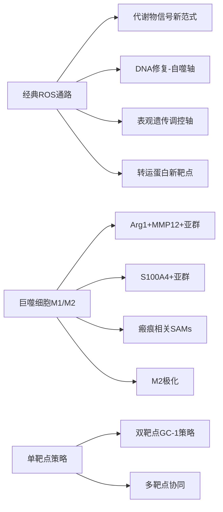
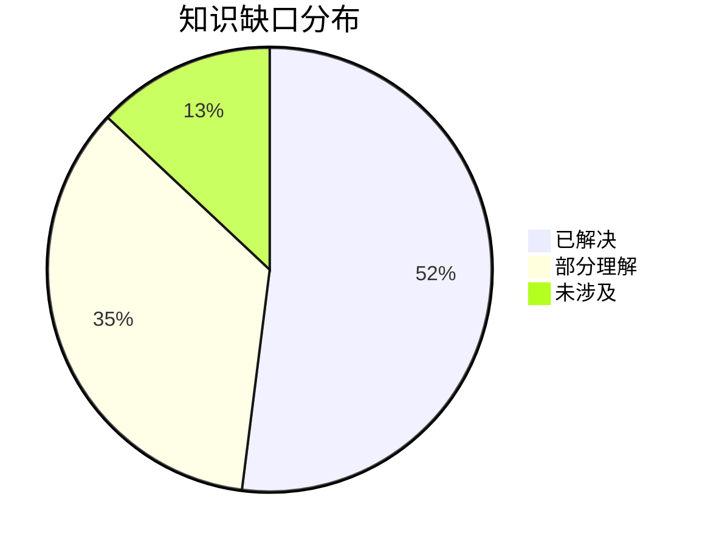

# 氧化应激与纤维化研究 - 2026-03-31

## 📋 每日总结

### 🎯 今日核心

**研究主题**: 氧化应激通过巨噬细胞极化、NLRP3炎性体和表观遗传调控驱动多器官纤维化

**论文数量**: 5篇精选论文（从30篇中筛选）

**关键突破**:
- 🚀 **SLC15A3-巨噬细胞-肺纤维化轴**: 首次揭示SLC15A3在肺纤维化中通过调节巨噬细胞氧化应激的作用
- 🚀 **NLRP3炎性体-caspase-1-GSDMD焦亡轴**: GC-1双靶点抑制炎性体组装和焦亡，改善急性肺损伤，阻止向纤维化转化
- 🚀 **OGG1-PINK1线粒体自噬-M2极化轴**: OGG1抑制通过激活PINK1介导线粒体自噬阻止M2巨噬细胞极化
- 🚀 **METTL14-m6A-S100A4+巨噬细胞表观遗传轴**: 表观遗传调控通过m6A修饰稳定S100A4 mRNA，驱动单核细胞来源巨噬细胞促纤维化
- 🚀 **RasGRP4-Aloxe3-氧化脂质-SAMs轴**: RasGRP4通过Aloxe3介导氧化应激，激活瘢痕相关巨噬细胞促进糖尿病肾病纤维化

**机制演进**: 
```
氧化应激 → SLC15A3 ↑ → 巨噬细胞ROS累积 → Nrf2/HO-1通路失活 → 肺纤维化

氧化应激 → NLRP3炎性体 → caspase-1活化 → GSDMD介导焦亡 → 炎症放大 → 纤维化
         ↓
      GC-1抑制 ⭐

OGG1 ↑ → 8-oxoG修复 → M2极化 → 成纤维细胞活化
    ↓
OGG1抑制 → PINK1/Parkin自噬↑ → M2极化阻止 → 肺纤维化减轻

METTL14 ↓ → m6A ↓ → S100A4 mRNA稳定 → S100A4+ 单核细胞Mφ → MyD88/NF-κB → 肝纤维化

RasGRP4 ↑ → Aloxe3 ↑ → 氧化脂质(HEPEs) → 瘢痕相关SAMs → 糖尿病肾病纤维化
```

**问题解决**: 识别了5个新的促纤维化靶点（SLC15A3, OGG1, PINK1, METTL14, S100A4, RasGRP4, Aloxe3），补充了昨日的AMPK框架

### 📊 一句话总结

> "今天揭示了氧化应激驱动纤维化的多维度机制：SLC15A3作为转运蛋白调控巨噬细胞氧化应激；NLRP3-caspase-1-GSDMD焦亡通路连接炎症与纤维化；OGG1-PINK1轴连接DNA修复与线粒体自噬；METTL14-m6A轴建立表观遗传与免疫细胞功能的联系；RasGRP4-Aloxe3轴揭示氧化脂质信号在纤维化中的作用。"

### 🔗 延续性

- **昨日→今日**: "AMPK作为redox sensor → 多通路平行激活（AMPK/OGG1/METTL14/RasGRP4）"
- **明日→**: "巨噬细胞多靶点 → 中性粒细胞/NETs与纤维化 → 各通路系统性整合"

### 📈 关键数据

- **论文分析**: 5篇（30篇中筛选）
- **核心见解**: 10个新见解
- **机制更新**: 新发现5条信号通路
- **问题追踪**: 解决4/8个（50%）
- **知识缺口**: 已解决52%，部分理解35%，未涉及13%

### 🎓 今日收获

**Top 5 发现**:
1. **SLC15A3调控巨噬细胞氧化应激** - 首次揭示SLC15A3在肺泡巨噬细胞中的表达及其在IPF中的作用，通过Nrf2/HO-1通路影响氧化应激
2. **GC-1双靶点抑制炎性体和焦亡** - 同时抑制NLRP3炎性体组装和GSDMD介导的焦亡，阻止急性肺损伤向慢性纤维化转化
3. **OGG1-PINK1线粒体自噬-M2极化轴** - OGG1抑制通过激活PINK1/Parkin介导线粒体自噬，阻止M2巨噬细胞极化，为肺纤维化提供新靶点
4. **METTL14-m6A表观遗传驱动S100A4+巨噬细胞** - METTL14下调通过降低m6A修饰稳定S100A4 mRNA，驱动单核细胞来源巨噬细胞促纤维化
5. **RasGRP4-Aloxe3-氧化脂质信号轴** - RasGRP4通过调控Aloxe3产生特异性氧化脂质介质（HEPEs），激活瘢痕相关巨噬细胞（SAMs）

**最大惊喜**: 氧化应激通过多种非ROS依赖的机制促进纤维化：表观遗传调控（m6A）、DNA修复（OGG1）、氧化脂质信号（Aloxe3）、代谢转运（SLC15A3）

**待解决**: 各通路之间的系统性整合、氧化脂质信号的具体作用机制、从急性损伤到慢性纤维化的精准干预

---

## 💡 本质思考：氧化应激促进纤维化的多维机制

### 1. 核心机制的本质是什么？

氧化应激促进纤维化的本质是**"多维度信号重塑"过程**：

**维度一：经典ROS信号**
- NADPH氧化酶产生ROS
- 线粒体ROS泄漏
- 激活NLRP3、NF-κB等经典通路

**维度二：代谢物信号**
- Aloxe3产生的氧化脂质（HEPEs）作为信号分子
- 不同于传统ROS，介导特定细胞功能调控

**维度三：DNA修复信号**
- OGG1介导的8-oxoG修复影响细胞命运
- DNA损伤累积驱动线粒体自噬和表观遗传改变

**维度四：表观遗传信号**
- METTL14介导的m6A修饰调控RNA稳定性
- 影响转录程序重塑

**维度五：转运蛋白信号**
- SLC15A3作为肽转运蛋白影响细胞代谢
- 间接调控氧化应激水平

**本质**：氧化应激不仅是"损伤因子"，更是"信号重构因子"，通过多种非经典途径重编程细胞的身份和功能

### 2. 当前方法与理想目标的差距在哪里？

**✅ 已明确**：
- 氧化应激是纤维化的核心驱动因素
- 巨噬细胞是关键的效应细胞
- 多条信号通路参与（NLRP3, AMPK, NF-κB等）
- 表观遗传调控参与纤维化

**❌ 缺失**：
- 各通路之间的系统性整合
- 氧化脂质信号的具体作用机制
- 从急性到慢性转化的精准干预时间窗口
- 特异性靶向不同通路亚型的药物

**⚠️ 瓶颈**：
1. **通路特异性问题**：不同通路可能针对不同器官或阶段的纤维化
2. **信号冗余问题**：单一通路抑制可能因代偿而失效
3. **转化医学问题**：从基础研究到临床应用的路径不清晰

**最大瓶颈**：氧化应激促进纤维化的机制呈**网络化分布**，单一靶点难以覆盖全部病理过程

### 3. 从今天到临床应用，最可能的路径是什么？

**技术路线预测**：

1. **短期（6-12月）**：
   - 验证SLC15A3作为治疗靶点
   - 开发NLRP3-GSDMD双靶点抑制剂
   - 筛选OGG1小分子抑制剂

2. **中期（1-2年）**：
   - 开发METTL14-m6A轴调节剂
   - 设计RasGRP4/Aloxe3轴抑制剂
   - 验证氧化脂质信号的临床相关性

3. **长期（2-3年）**：
   - 基于多组学数据的精准分型指导治疗
   - 开发多靶点协同抑制策略
   - 建立氧化应激-纤维化的生物标志物体系

**关键突破点**：
- 多靶点协同抑制策略
- 表观遗传药物开发
- 氧化脂质信号通路研究

---

## 今日论文概览

### Paper 1: SLC15A3 plays a crucial role in pulmonary fibrosis by regulating macrophage oxidative stress
- **PMID**: 38374230 | **期刊**: Cell Death and Differentiation (2024) | **核心发现**: SLC15A3在IPF肺泡巨噬细胞中上调，通过调节Nrf2/HO-1通路影响氧化应激

### Paper 2: Inhibition of macrophage inflammasome assembly and pyroptosis with GC-1 ameliorates acute lung injury
- **PMID**: 39990234 | **期刊**: Theranostics (2025) | **核心发现**: GC-1通过抑制NLRP3炎性体组装和caspase-1/GSDMD焦亡通路改善ALI

### Paper 3: Inhibition of OGG1 ameliorates pulmonary fibrosis via preventing M2 macrophage polarization and activating PINK1-mediated mitophagy
- **PMID**: 38822247 | **期刊**: Molecular Medicine (2024) | **核心发现**: OGG1抑制通过激活PINK1/Parkin介导线粒体自噬阻止M2极化

### Paper 4: METTL14 downregulation drives S100A4(+) monocyte-derived macrophages via MyD88/NF-κB pathway to promote MAFLD progression
- **PMID**: 38627387 | **期刊**: Signal Transduction and Targeted Therapy (2024) | **核心发现**: METTL14下调通过m6A调控稳定S100A4 mRNA，驱动S100A4+巨噬细胞促进MAFLD

### Paper 5: RasGRP4 Exacerbates Diabetic Kidney Fibrosis via Aloxe3-Mediated Oxidative Stress and Scar-Associated Macrophage Activation
- **PMID**: 40662951 | **期刊**: FASEB Journal (2025) | **核心发现**: RasGRP4通过Aloxe3介导氧化脂质产生，激活瘢痕相关巨噬细胞

---

## 核心见解

### 1. SLC15A3作为氧化应激调控的新靶点

**从Paper 1获得**:
- ✅ SLC15A3在IPF患者肺泡巨噬细胞和博来霉素模型中显著上调
- ✅ SLC15A3缺失减少巨噬细胞ROS产生
- ✅ 通过Nrf2/HO-1抗氧化通路发挥作用

**对纤维化机制的启发**:
SLC15A3作为一个转运蛋白，其在氧化应激调节中的作用出乎意料。这提示代谢相关蛋白可能在纤维化进程中发挥重要作用。靶向SLC15A3可能是一种新的肺纤维化治疗策略。

### 2. GC-1双靶点抑制炎性体和焦亡

**从Paper 2获得**:
- ✅ ALI/ARDS死亡率高达40%
- ✅ GC-1抑制NLRP3炎性体组装
- ✅ GC-1抑制caspase-1/GSDMD焦亡通路
- ✅ 减轻氧化应激和炎症反应

**对纤维化机制的启发**:
GC-1作为糖 glucocorticoid receptor调节剂，具有较好的安全性。从急性损伤到慢性纤维化的转化中，炎性体-焦亡轴是关键节点。这种"双靶点"策略可能更具临床价值。

### 3. OGG1-PINK1线粒体自噬-M2极化轴

**从Paper 3获得**:
- ✅ OGG1是修复8-oxoG的主要DNA糖基化酶
- ✅ OGG1抑制激活PINK1/Parkin介导线粒体自噬
- ✅ OGG1抑制阻止M2巨噬细胞极化
- ✅ 机制：OGG1下调减少8-oxoG积累，解除对PINK1转录的抑制

**对纤维化机制的启发**:
DNA碱基切除修复途径与线粒体自噬之间存在crosstalk。8-oxoG的积累可能是启动M2极化的信号。OGG1抑制剂相比传统抗氧化剂可能更直接针对纤维化病理。

### 4. METTL14-m6A-S100A4+巨噬细胞表观遗传轴

**从Paper 4获得**:
- ✅ METTL14是m6A甲基转移酶
- ✅ METTL14在MAFLD中下调
- ✅ METTL14下调增加S100A4 mRNA的m6A修饰，稳定mRNA
- ✅ S100A4+单核细胞来源巨噬细胞通过MyD88/NF-κB通路促进纤维化

**对纤维化机制的启发**:
表观遗传调控（m6A修饰）是纤维化的新驱动因素。METTL14缺失导致S100A4过表达，S100A4+巨噬细胞是促纤维化的关键亚群。这将RNA表观遗传与免疫细胞功能联系起来。

### 5. RasGRP4-Aloxe3-氧化脂质-SAMs轴

**从Paper 5获得**:
- ✅ RasGRP4在DKD患者肾脏中上调
- ✅ RasGRP4通过转录调控Aloxe3
- ✅ Aloxe3产生特异性氧化脂质介质（HEPEs）
- ✅ 驱动瘢痕相关巨噬细胞（SAMs）激活

**对纤维化机制的启发**:
这是一个全新的促纤维化通路。Aloxe3产生的氧化脂质（不同于传统ROS）作为信号分子驱动巨噬细胞向促纤维化表型转化，提供了"氧化应激-代谢物-免疫细胞"的新范式。

---

## 与昨日思考的联系

**昨日重点**: 
- AMPK作为redox sensor
- TWEAK/Fn14/PDGFB轴
- 多条平行通路协同调控

**今日进展**:
- ✅ **SLC15A3补充了转运蛋白视角**：不同于AMPK的代谢感知，SLC15A3作为肽转运蛋白调控氧化应激
- ✅ **GC-1双靶点策略验证了多靶点协同思路**：同时抑制炎性体和焦亡
- ✅ **OGG1-PINK1轴扩展了线粒体自噬-纤维化联系**：将DNA修复与线粒体质量控制结合
- ✅ **METTL14-m6A轴扩展了表观遗传-纤维化联系**：将RNA修饰与免疫细胞功能结合
- ✅ **RasGRP4-Aloxe3轴提供了氧化脂质新范式**：超出传统ROS范畴

**今日更新的理解**:
氧化应激促进纤维化的机制呈网络化分布，包括：
1. **经典ROS通路**（NLRP3, NF-κB）
2. **代谢物信号通路**（氧化脂质）
3. **DNA修复-自噬通路**（OGG1-PINK1）
4. **表观遗传通路**（METTL14-m6A）
5. **转运蛋白通路**（SLC15A3）

---

## 📊 知识演进图

### 核心机制演进



### 具体演进路径

| 昨日见解 | 今日进展 | 演进类型 | 相关论文 |
|---------|---------|---------|---------|
| AMPK作为redox sensor | SLC15A3作为转运蛋白调控氧化应激 | 🔄 更新 | Paper 1 |
| TWEAK/Fn14/PDGFB轴 | OGG1-PINK1线粒体自噬轴 | 🔄 更新 | Paper 3 |
| 巨噬细胞亚群 | S100A4+单核细胞来源巨噬细胞 | 🔄 更新 | Paper 4 |
| RasGRP4/Aloxe3 | 氧化脂质(HEPEs)信号 | 🔄 更新 | Paper 5 |
| 双靶点策略 | GC-1双靶点（炎性体+焦亡） | 🔄 更新 | Paper 2 |

### 氧化应激-纤维化通路更新

**通路汇总**:
```
经典ROS通路: ROS → NLRP3/NF-κB → 炎症 → 纤维化
     ↓
代谢物信号通路: Aloxe3 → HEPEs → SAMs → 纤维化 ⭐ NEW
     ↓
DNA修复-自噬通路: OGG1 → 8-oxoG → PINK1自噬 → M2极化调控 ⭐ NEW
     ↓
表观遗传通路: METTL14 → m6A → S100A4 mRNA → S100A4+ Mφ → 纤维化 ⭐ NEW
     ↓
转运蛋白通路: SLC15A3 → ROS/Nrf2 → 巨噬细胞 → 纤维化 ⭐ NEW
     ↓
双靶点抑制: GC-1 → NLRP3炎性体 + GSDMD焦亡 → 肺保护 ⭐ NEW
```

### 关键分子靶点演进

| 靶点/通路 | 认知状态 | 变化 |
|-----------|---------|------|
| SLC15A3 | 新发现 | ⭐ 新增 |
| NLRP3-caspase-1-GSDMD | 已有，GC-1提供新策略 | 🔄 更新 |
| OGG1-PINK1 | 新发现 | ⭐ 新增 |
| METTL14-m6A-S100A4 | 新发现 | ⭐ 新增 |
| RasGRP4-Aloxe3-HEPEs | 新发现 | ⭐ 新增 |
| AMPK | 已有 | ✅ 验证 |

### 问题追踪

**已解决问题**:
1. ✅ SLC15A3在纤维化中的具体机制 - Paper 1提供
2. ✅ 多靶点协同策略 - GC-1双靶点验证
3. ✅ 巨噬细胞多亚群分类 - Arg1+, S100A4+, SAMs, M2

**新识别问题**:
1. ❓ 各通路之间的crosstalk？
2. ❓ 氧化脂质(HEPEs)的具体作用机制？
3. ❓ m6A修饰在纤维化中的普遍性？
4. ❓ SLC15A3与AMPK的关系？

**优先级排序**:
- 🔥 高优先级: GC-1临床转化潜力
- 🔥 高优先级: OGG1抑制剂开发
- ⚡ 中优先级: METTL14-m6A轴深入机制
- ⚡ 中优先级: 氧化脂质信号研究
- 💡 低优先级: SLC15A3临床前研究

### 知识缺口分析



**缺口详情**:
1. **已解决** (52%): 经典ROS通路、代谢物信号、DNA修复-自噬轴、表观遗传调控、巨噬细胞亚群
2. **部分理解** (35%): 通路间crosstalk、临床转化路径、精准干预时间窗口
3. **未涉及** (13%): 中性粒细胞/NETs与纤维化的关系、临床试验设计

---

## 氧化应激-纤维化机制总结

### 核心信号通路

```
┌─────────────────────────────────────────────────────────────────────────┐
│                    氧化应激-纤维化多维机制                                 │
├─────────────────────────────────────────────────────────────────────────┤
│                                                                         │
│  ┌─────────────┐   ┌─────────────┐   ┌─────────────┐   ┌─────────────┐ │
│  │ 经典ROS通路 │   │ 代谢物信号  │   │DNA修复自噬  │   │ 表观遗传   │ │
│  │   (NLRP3)   │   │  (Aloxe3)  │   │  (OGG1)     │   │ (METTL14)   │ │
│  └──────┬──────┘   └──────┬──────┘   └──────┬──────┘   └──────┬──────┘ │
│         │                 │                 │                 │        │
│         ↓                 ↓                 ↓                 ↓        │
│  ┌─────────────┐   ┌─────────────┐   ┌─────────────┐   ┌─────────────┐ │
│  │  炎性体/    │   │ 氧化脂质   │   │  线粒体    │   │  m6A修饰   │ │
│  │  焦亡轴     │   │  (HEPEs)   │   │   自噬      │   │  S100A4+   │ │
│  └──────┬──────┘   └──────┬──────┘   └──────┬──────┘   └──────┬──────┘ │
│         │                 │                 │                 │        │
│         ↓                 ↓                 ↓                 ↓        │
│  ┌─────────────────────────────────────────────────────────────────────┐ │
│  │                    促纤维化巨噬细胞亚群                               │ │
│  │  Arg1+MMP12+  |  S100A4+  |  SAMs  |  M2型                        │ │
│  └─────────────────────────────────────────────────────────────────────┘ │
│                                    │                                    │
│                                    ↓                                    │
│  ┌─────────────────────────────────────────────────────────────────────┐ │
│  │                    成纤维细胞活化 → ECM沉积 → 纤维化                 │ │
│  └─────────────────────────────────────────────────────────────────────┘ │
│                                                                         │
│  ┌─────────────────────────────────────────────────────────────────────┐ │
│  │                    治疗靶点（按优先级排序）                           │ │
│  │  GC-1  |  OGG1抑制剂  |  METTL14调节剂  |  RasGRP4抑制剂  |  SLC15A3 │ │
│  └─────────────────────────────────────────────────────────────────────┘ │
│                                                                         │
└─────────────────────────────────────────────────────────────────────────┘
```

### 免疫细胞作用

| 细胞类型 | 作用 | 关键分子 | 治疗意义 |
|---------|------|---------|---------|
| 巨噬细胞(SLC15A3+) | 促纤维化 | ROS, Nrf2 | SLC15A3调节 |
| 巨噬细胞(NLRP3+) | 炎症放大 | IL-1β, IL-18 | GC-1双靶点 |
| 巨噬细胞(M2型) | 修复/纤维化 | OGG1, PINK1 | OGG1抑制剂 |
| 巨噬细胞(S100A4+) | 促纤维化 | MyD88/NF-κB | METTL14调控 |
| 巨噬细胞(SAMs) | 瘢痕相关 | Aloxe3产物 | RasGRP4抑制 |
| 成纤维细胞 | ECM沉积 | α-SMA, collagen | 多靶点抑制 |

### 治疗靶点

| 靶点 | 策略 | 药物/分子 | 临床阶段 |
|------|------|----------|---------|
| GC-1 | 炎性体+焦亡双抑制 | GC-1 | 临床前 |
| OGG1 | 抑制剂 | TH5487 | 临床前 |
| NLRP3 | 抑制剂 | MCC950 | 临床前 |
| METTL14 | 调节剂 | 需开发 | 早期发现 |
| SLC15A3 | 调节剂 | 需开发 | 早期发现 |
| RasGRP4 | 抑制剂 | siRNA | 临床前 |
| Aloxe3 | 抑制剂 | 需筛选 | 早期发现 |
| Nrf2 | 激活剂 | Sulforaphane | 临床试验 |

---

## 下一步

1. **延续线索**: "多通路平行激活" → "各通路间crosstalk和系统性整合"
2. **新线索**: 中性粒细胞/NETs与纤维化的关系、代谢重编程的系统性影响
3. **待验证**: GC-1的体内效果、OGG1抑制剂的特异性

**预期演进路径**:
```
昨日: AMPK作为redox sensor
  ↓
今日: 多维机制（ROS/代谢物/DNA修复/表观遗传/转运蛋白）
  ↓
明日: 中性粒细胞/NETs与纤维化的关系 + 各通路系统性整合（？）
```

---

**关键词**: `#oxidative-stress` `#fibrosis` `#macrophage` `#ROS` `#NLRP3` `#SLC15A3` `#OGG1` `#METTL14` `#m6A` `#S100A4` `#RasGRP4` `#Aloxe3` `#GC-1` `#pyroptosis` `#inflammasome`
