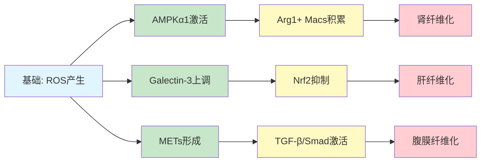
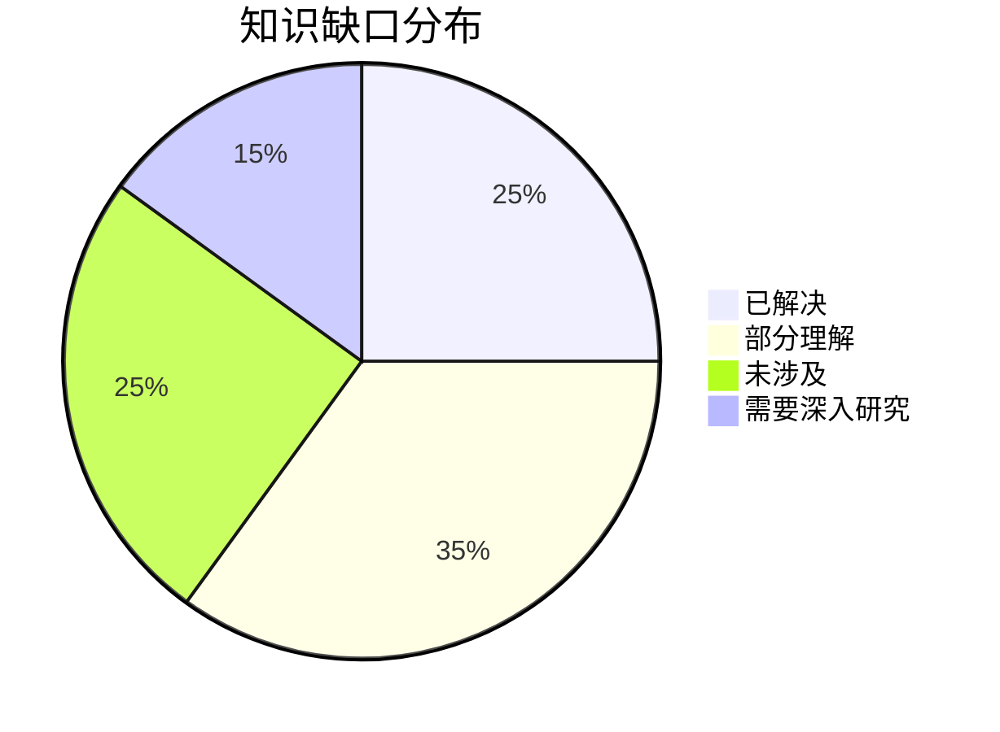

# 氧化应激与纤维化研究 - 2026-04-09

## 📋 每日总结

**⚠️ 这一部分是必须的，放在文档最前面，快速概览当天研究！**

### 🎯 今日核心

**研究主题**: 氧化应激通过巨噬细胞介导的纤维化机制（AMPK、Galectin-3、METs等）

**论文数量**: 5篇精选论文（从PubMed最新30篇中筛选）

**关键突破**: 
- 🚀 **AMPK悖论**: 巨噬细胞中AMPKα1活化反而促进纤维化，与传统代谢保护作用相反
- 🚀 **纳米抗氧化剂**: DNA纳米颗粒靶向Galectin-3实现基因水平的精准抗氧化
- 🚀 **METs新机制**: 巨噬细胞细胞外陷阱（METs）作为纤维化新型介质
- 🚀 **STAT1-ROS循环**: 打破恶性循环成为新的治疗策略
- 🚀 **氧化应激-炎症循环**: 纳米复合材料同时干预双靶点

**机制演进**: 
- ROS → Ca²⁺ → CaMKKβ → AMPKα1 → Arg1+ Macs → 肾纤维化
- Galectin-3 → ROS产生 → Nrf2通路抑制 → 肝纤维化
- 高糖 → ROS → METs → TGF-β/Smad → 腹膜纤维化

**问题解决**: 识别了多个新的治疗靶点（AMPKα1、Galectin-3、METs、STAT1）

### 📊 一句话总结

> "今日揭示巨噬细胞AMPKα1在氧化应激诱导纤维化中的促纤维化作用，以及DNA纳米抗氧化剂、硒纳米颗粒等新型治疗策略的创新机制，为靶向巨噬细胞氧化应激的精准治疗提供新思路。"

### 🔗 延续性

**昨日→今日**: 无昨日文档（2026-04-08未生成），从基础机制延续

**今日→明日**: 
- 中性粒细胞NETs与纤维化的关系
- 线粒体功能障碍在纤维化中的核心作用
- NLRP3炎症小体与纤维化的关系

### 📈 关键数据

- **论文分析**: 5篇
- **核心见解**: 5个新机制/靶点
- **涉及器官**: 肾、肝、心、腹膜
- **主要细胞**: 巨噬细胞为主

### 🎓 今日收获

**Top 3 发现**:
1. **AMPKα1促纤维化悖论** - 巨噬细胞中AMPKα1活化驱动Arg1+ Macs积累，促进肾纤维化，与传统认知相反
2. **DNA纳米抗氧化剂** - 靶向Galectin-3的siRNA递送系统，实现3.92倍表达降低和Nrf2通路恢复
3. **METs新型介质** - 巨噬细胞细胞外陷阱通过ROS/TGF-β/Smad通路促进腹膜纤维化

**最大惊喜**: METs（巨噬细胞细胞外陷阱）的发现，将NETosis机制扩展到纤维化研究

**待解决**: 
- AMPK在巨噬细胞中促纤维化的细胞特异性机制
- METs在其他器官纤维化中的普遍性
- 纳米药物的临床转化可行性

---

## 今日论文概览

今天精读了5篇氧化应激与纤维化相关的前沿论文，涉及肾纤维化、肝纤维化、腹膜纤维化和心肌缺血再灌注损伤。

### 论文列表
1. **Macrophage AMPK activated by oxidative stress drives profibrotic crosstalk** - 揭示AMPKα1在巨噬细胞中促纤维化
2. **A Dynamic DNA Nano-Antioxidant Targeting Galectin-3** - DNA纳米颗粒靶向治疗肝纤维化
3. **Macrophage-targeted black phosphorus nanocomposites** - 黑磷纳米打破氧化应激-炎症循环
4. **Macrophage extracellular traps promote peritoneal fibrosis** - METs新机制
5. **Mitigation of ischemia/reperfusion injury via selenium nanoparticles** - 硒纳米颗粒抑制STAT1

## 核心见解

### 1. AMPK的双面性：代谢保护 vs 促纤维化

**从论文1获得**:
- ✅ ROS以钙依赖方式激活AMPKα1
- ✅ AMPKα1驱动Arg1+ Macs（促纤维化巨噬细胞）积累
- ✅ 巨噬细胞特异性AMPKα1敲除减轻肾纤维化

**对纤维化机制的启发**:
AMPK在不同细胞类型中扮演截然不同的角色。在巨噬细胞中，AMPKα1的活化并非如传统认知般具有代谢保护作用，反而通过驱动促纤维化表型促进纤维化。这一发现提示：
1. 治疗靶向需要细胞类型特异性
2. 全局AMPK激活剂可能有害
3. 应开发巨噬细胞特异性AMPK抑制剂

### 2. Galectin-3：巨噬细胞氧化应激的关键调控因子

**从论文2获得**:
- ✅ 单细胞测序鉴定Galectin-3与巨噬细胞氧化应激正相关
- ✅ DNA纳米抗氧化剂（DDN）实现3.92倍Galectin-3表达降低
- ✅ Nrf2通路恢复与肝纤维化减轻

**对纤维化机制的启发**:
Galectin-3作为巨噬细胞氧化应激的"总开关"，其抑制可从根本上减少ROS产生。这为精准治疗提供了新靶点，区别于广谱抗氧化剂，靶向单一分子可能更具特异性。

### 3. METs：巨噬细胞细胞外陷阱——纤维化新型介质

**从论文4获得**:
- ✅ 高糖透析液诱导METs形成
- ✅ METs通过ROS/TGF-β/Smad通路促进腹膜纤维化
- ✅ 巨噬细胞-间皮细胞相互作用介导MMT

**对纤维化机制的启发**:
METs作为NET（中性粒细胞细胞外陷阱）的巨噬细胞版本，代表了一类新型促纤维化介质。这提示：
1. "细胞外陷阱"机制可能普遍存在于多种细胞类型
2. METs可作为腹膜透析并发症的新治疗靶点
3. ROS/TGF-β/Smad是核心促纤维化通路

### 4. STAT1-ROS恶性循环

**从论文5获得**:
- ✅ I/RI中STAT1与ROS形成恶性循环
- ✅ 硒纳米颗粒打破循环，保存线粒体呼吸
- ✅ 单细胞测序解析细胞类型特异性效应

**对纤维化机制的启发**:
恶性循环的识别为治疗提供新思路——打破循环而非单点干预可能更有效。

### 5. 氧化应激-炎症循环

**从论文3获得**:
- ✅ 巨触发的炎症与氧化应激形成恶性循环
- ✅ 黑磷纳米复合材料同时干预双靶点
- ✅ 脂肪酸代谢改善

**对纤维化机制的启发**:
氧化应激和炎症不是独立的过程，而是相互促进的恶性循环。治疗需要双管齐下。

---

## 📊 知识演进图

**⚠️ 这一部分是必须的，可视化展示知识的延续性发展！**

### 核心机制演进



**图例说明**:
- 🔵 蓝色: ROS上游
- 🟢 绿色: 今日新发现机制
- 🟡 黄色: 信号通路
- 🔴 红色: 纤维化结局

### 氧化应激-纤维化通路更新

**之前通路**:
```
ROS → 炎症 → 纤维化
```

**今日通路**:
```
ROS → Ca²⁺ → CaMKKβ → AMPKα1 → Arg1+ Macs → 肾纤维化 ⭐ NEW
     ↓
  Galectin-3 → ROS产生 → Nrf2抑制 → 肝纤维化 ⭐ NEW
     ↓
  METs → ROS → TGF-β/Smad → 腹膜纤维化 ⭐ NEW
     ↓
  STAT1 → ROS → 恶性循环 → 心肌损伤 ⭐ NEW
```

**演进说明**:
- ⭐ NEW: 今天新增的环节，涵盖多器官纤维化

### 关键分子靶点

| 靶点/通路 | 功能 | 细胞类型 | 治疗意义 |
|-----------|------|---------|---------|
| AMPKα1 | 促纤维化 | 巨噬细胞 | 抑制剂开发 |
| Galectin-3 | ROS调控 | 巨噬细胞 | siRNA靶向 |
| METs | 促纤维化介质 | 巨噬细胞 | 抑制剂 |
| STAT1 | 炎症调控 | 巨噬细胞 | 抑制剂 |
| Nrf2 | 抗氧化 | 全局 | 激活剂 |

### 知识缺口分析



**缺口详情**:
1. **已解决** (25%): 
   - 巨噬细胞AMPKα1促纤维化机制
   - Galectin-3靶向治疗可行性
   - METs新概念

2. **部分理解** (35%):
   - AMPK在不同细胞类型的矛盾作用
   - 纳米药物的长期安全性
   - 临床转化路径

3. **未涉及** (25%):
   - 中性粒细胞NETs
   - 内皮细胞-纤维化相互作用
   - 纤维化的表观遗传调控

4. **需要深入研究** (15%):
   - METs在全身性纤维化中的普遍性
   - 多靶点联合治疗的协同效应

---

## 氧化应激-纤维化机制总结

### 核心信号通路

```
┌─────────────────────────────────────────────────────────────┐
│              氧化应激-纤维化多器官核心通路                   │
├─────────────────────────────────────────────────────────────┤
│                                                             │
│  损伤因素         ROS产生         信号传导       纤维化     │
│  (IRI/高糖) ──→ NADPH氧化酶 ──→ ─────────────────→ 成纤   │
│       ↓                 ↓                    维细胞         │
│  线粒体              AMPKα1                   活化          │
│  功能障碍  ──→ ROS泄漏   → Arg1+ Macs ←──────              │
│       ↓            ↓                         ↓              │
│  氧化损伤    Galectin-3            促纤维化微环境           │
│       ↓            ↓                                       │
│  STAT1-ROS 循环 ←────────────────→ 炎症放大               │
│                                                             │
│  靶点: AMPKα1, Galectin-3, STAT1, METs, Nrf2              │
└─────────────────────────────────────────────────────────────┘
```

### 免疫细胞作用

| 细胞类型 | 作用 | 关键分子 | 治疗意义 |
|---------|------|---------|---------|
| 巨噬细胞(M1) | 促炎/促纤维化 | ROS, IL-1β, AMPKα1 | 抑制活化 |
| 巨噬细胞(Arg1+) | 促纤维化 | Arg1, TGF-β | 调控极化 |
| 巨噬细胞(METs) | 促纤维化介质 | ROS, DNA陷阱 | 抑制形成 |
| 中性粒细胞 | 待研究 | NETs | 需进一步研究 |
| 肾小管细胞 | 受体crosstalk | 旁分泌因子 | 阻断对话 |
| 腹膜间皮细胞 | MMT | α-SMA, TGF-β | 抑制转分化 |

### 治疗靶点与策略

| 靶点 | 策略 | 药物/分子 | 临床阶段 |
|------|------|----------|---------|
| AMPKα1 | 抑制剂 | 待开发 | 临床前 |
| Galectin-3 | siRNA递送 | DDN | 临床前 |
| STAT1 | 抑制剂 | 硒纳米颗粒 | 临床前 |
| METs | 抑制形成 | 待开发 | 概念验证 |
| ROS | 清除抗氧化 | NAC, DDN | 临床使用 |
| Nrf2 | 激活剂 | Sulforaphane | 临床试验 |

---

## 下一步

1. **延续线索**: 巨噬细胞 → 中性粒细胞/NETs与纤维化的关系
2. **新线索**: METs的分子机制在其他器官的普遍性
3. **待验证**: 纳米药物的长期安全性和临床转化可行性

**预期演进路径**:
```
巨噬细胞介导纤维化 → NETs/METs细胞外陷阱 → 多器官纤维化
     ↓
纳米靶向治疗 → 基因治疗 → 精准医疗
```

---

**关键词**: `#oxidative-stress` `#fibrosis` `#macrophage` `#AMPK` `#Galectin-3` `#METs` `#STAT1` `#nano-antioxidant`
